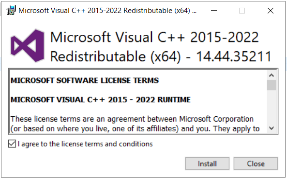
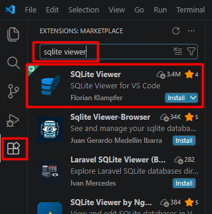
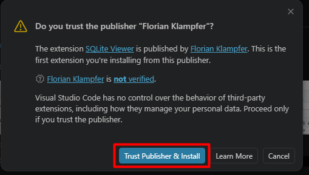
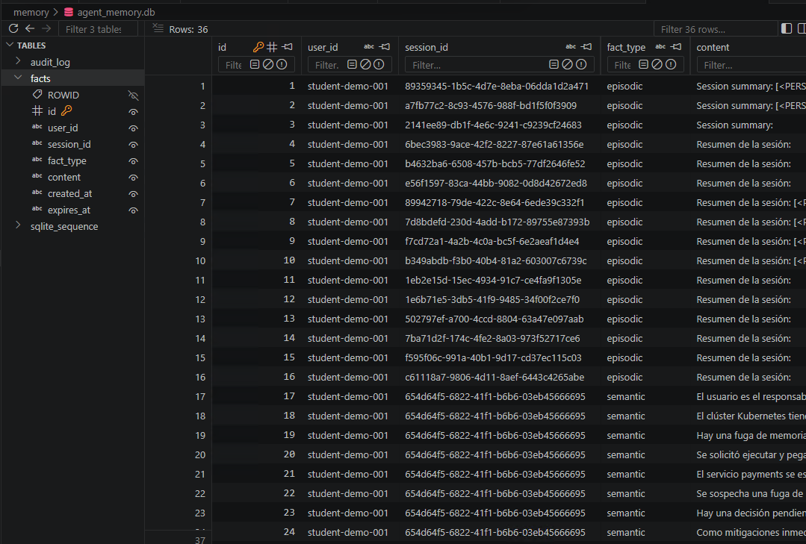

# Implementar Módulo de Memoria y Políticas de Retención

## Metadatos

| Campo | Valor |
|---|---|
| **Duración estimada** | 50 minutos |
| **Nivel Bloom** | Aplicar |
| **Lab anterior requerido** | Lab 03-00-01, Lab 04-00-01 |

---

## Descripción General

En este laboratorio extenderás el agente construido en los Labs 3 y 4 con un módulo de memoria bicapa: una capa de **corto plazo** basada en Redis (contexto de sesión activa con TTL configurable) y una capa de **largo plazo** basada en SQLite (hechos persistentes indexados por usuario). Implementarás un mecanismo de resumen automático con GPT-4o-mini para comprimir conversaciones largas, configurarás políticas de retención declarativas en YAML, y aplicarás detección y anonimización de PII con Presidio antes de persistir cualquier dato. Al finalizar, probarás la transferencia de contexto entre dos instancias del agente simulando el cierre y reapertura de sesión.

> ⚠️ **Aviso de privacidad:** Este lab trabaja con detección de PII. **Nunca uses datos reales de personas.** Todos los datos de prueba deben ser sintéticos.

---

## Objetivos de Aprendizaje

Al completar este laboratorio, serás capaz de:

- [ ] Implementar memoria a corto plazo con Redis y TTL configurable, y memoria a largo plazo con SQLite indexada por usuario.
- [ ] Configurar resumen automático de conversaciones largas usando GPT-4o-mini para comprimir el contexto sin perder información crítica.
- [ ] Diseñar políticas de retención declarativas en YAML que especifiquen qué datos guardar, por cuánto tiempo y bajo qué condiciones eliminarlos.
- [ ] Aplicar detección y anonimización de PII con Presidio antes de persistir datos en cualquier capa de memoria.
- [ ] Verificar la transferencia de contexto entre sesiones simulando el ciclo cierre/reapertura de un agente.

---

## Prerrequisitos

### Conocimiento previo
- Haber completado Lab 03-00-01 (agente ReAct con LangGraph) y Lab 04-00-01 (herramientas y planificación).
- Comprensión básica de bases de datos relacionales (SQL) y almacenes clave-valor (Redis).
- Conocimiento básico del concepto de PII (Información de Identificación Personal) y principios de privacidad por diseño.

---

## Entorno del Laboratorio

### Requisitos de hardware

| Componente | Mínimo | Recomendado |
|---|---|---|
| CPU | 4 núcleos | 8 núcleos |
| RAM | 16 GB | 32 GB |
| Disco libre | 3 GB | 5 GB |
| Red | 10 Mbps | 25 Mbps |

### Software y versiones

| Paquete | Versión | Propósito |
|---|---|---|
| Python | 3.11.x | Entorno base |
| Redis (Docker) | 7.2.x | Memoria de corto plazo |
| SQLite3 | 3.45.x (built-in) | Memoria de largo plazo |
| LangGraph | 0.2.x | Agente con memoria integrada |
| LangChain | 0.3.x | Abstracciones de cadena/memoria |
| OpenAI SDK | 1.40.x | Resumen con GPT-4o-mini |
| Presidio Analyzer | 2.2.x | Detección de PII |
| Presidio Anonymizer | 2.2.x | Anonimización de PII |
| spaCy | 3.x | Modelo NLP para Presidio |
| PyYAML | 6.x | Políticas de retención |
| redis-py | 5.x | Cliente Python para Redis |
| Pydantic | 2.8.x | Modelos de datos |

### Preparación del entorno

En una nueva ventana del navegador de la máquina virtual abre https://aka.ms/vs/17/release/vc_redist.x64.exe

Directamente se descarga el archivo .exe en la carpeta Downloads. Ejecútalo como Administrador.



>⚠️En la terminal ejecuta el comando ```exit```. Además, debes cerrar y volver a abrir Visual Studio Code.

Abre una nueva terminal en VSC y lanza los siguientes comandos:

```bash
# 1. Crear y activar entorno virtual separado para este lab
cd ~
mkdir Lab06
cd Lab06
python -m venv .venv-lab06
.venv-lab06\Scripts\Activate.ps1

# 2. Instalar dependencias
pip install "langchain==0.3.*" "langchain-openai==0.2.*" "langgraph==0.2.*" "openai==1.40.*" "httpx<0.28.0" "presidio-analyzer==2.2.*" "presidio-anonymizer==2.2.*" "spacy==3.*" "redis==5.*" "pyyaml==6.*" "pydantic==2.8.*" tiktoken

pip install spacy
python -m spacy download es_core_news_sm

# 3. Descargar modelo NLP de spaCy requerido por Presidio
.\.venv-lab06\Scripts\python.exe -m pip install --upgrade --force-reinstall spacy click
python -m spacy download en_core_web_lg

#4 Ahora ejecuta el comando para levantar Redis con Docker:

docker run -d --name redis_lab06 -p 6379:6379 redis:7.2-alpine

#5 Verifica que Redis está activo
```bash
docker exec redis_lab06 redis-cli ping
# Salida esperada: PONG

# 6. Configurar API Key
$env:AZURE_OPENAI_API_KEY="tu_clave_de_azure_openai"
$env:AZURE_OPENAI_ENDPOINT="https://tu-recurso.openai.azure.com/"
$env:AZURE_OPENAI_DEPLOYMENT_NAME="gpt-5-mini"
$env:OPENAI_API_VERSION="2024-08-01-preview"
```

### Estructura de archivos del laboratorio

```
lab06/
├── config/
│   └── retention_policy.yaml      # Políticas de retención
├── memory/
│   ├── __init__.py
│   ├── short_term.py              # Capa Redis
│   ├── long_term.py               # Capa SQLite
│   ├── summarizer.py              # Resumen automático
│   └── pii_guard.py               # Detección y anonimización PII
├── agent/
│   ├── __init__.py
│   └── memory_agent.py            # Agente LangGraph con memoria
├── tests/
│   └── test_session_transfer.py   # Prueba de transferencia de sesión
└── main.py                        # Punto de entrada
```

```bash
# Crear la estructura de directorios
mkdir config, memory, agent, tests
New-Item -Path memory\__init__.py -ItemType File
New-Item -Path agent\__init__.py -ItemType File
```

---

## Pasos del Laboratorio

---

### Paso 1: Definir las Políticas de Retención en YAML

**Objetivo:** Crear un archivo de configuración declarativo que especifique qué tipos de datos guardar, sus TTL y los criterios de eliminación para cada capa de memoria.

#### Instrucciones

1. Crea el archivo `config/retention_policy.yaml`:

```yaml
# config/retention_policy.yaml
# Políticas de retención para el módulo de memoria agéntica
# IMPORTANTE: No incluir datos reales de personas en este archivo

version: "1.0"
description: "Políticas de retención y privacidad para agente con memoria bicapa"

short_term:
  # Memoria de sesión activa en Redis
  backend: redis
  default_ttl_seconds: 1800        # 30 minutos por defecto
  max_messages_before_summary: 10  # Resumir cuando se supere este límite
  max_tokens_before_summary: 2000  # Umbral alternativo en tokens
  fields_to_store:
    - role
    - content
    - timestamp
  fields_to_exclude:
    - raw_pii                      # Nunca almacenar PII sin anonimizar
  eviction_policy: "ttl_expiry"    # Eliminar automáticamente al expirar TTL

long_term:
  # Memoria persistente entre sesiones en SQLite
  backend: sqlite
  database_path: "./memory/agent_memory.db"
  retention_days: 30               # Eliminar registros con más de 30 días
  max_facts_per_user: 50           # Máximo de hechos almacenados por usuario
  fields_to_store:
    - user_id
    - fact_type                    # episodic | semantic | procedural
    - content_anonymized           # Solo contenido ya anonimizado
    - session_id
    - created_at
    - expires_at
  fact_types:
    episodic:
      ttl_days: 7                  # Hechos de episodios: 7 días
    semantic:
      ttl_days: 30                 # Conocimiento semántico: 30 días
    procedural:
      ttl_days: 90                 # Procedimientos: 90 días

privacy:
  pii_detection:
    enabled: true
    action: "anonymize"            # opciones: anonymize | redact | block
    entities_to_detect:
      - PERSON
      - EMAIL_ADDRESS
      - PHONE_NUMBER
      - CREDIT_CARD
      - US_SSN
      - LOCATION
      - DATE_TIME
    anonymization_operator: "replace"  # replace | mask | hash
  audit_log:
    enabled: true
    log_path: "./memory/audit.log"
    log_pii_detections: true       # Registrar detecciones sin el valor real
```

#### Salida esperada

El archivo YAML debe crearse sin errores de sintaxis. Puedes validarlo con:

```bash
python -c "import yaml; yaml.safe_load(open('config/retention_policy.yaml')); print('YAML válido ✓')"
```

#### Verificación

```
YAML válido ✓
```

---

### Paso 2: Implementar el Guardián de PII con Presidio

**Objetivo:** Crear el módulo `pii_guard.py` que detecta y anonimiza PII antes de que cualquier dato sea persistido en memoria.

#### Instrucciones

1. Crea el archivo `memory/pii_guard.py`:

```python
# memory/pii_guard.py
"""
Módulo de detección y anonimización de PII usando Microsoft Presidio.
AVISO: Este módulo debe invocarse SIEMPRE antes de persistir datos en memoria.
Nunca almacenes PII sin pasar por este guardián.
"""

import logging
from typing import Optional
from presidio_analyzer import AnalyzerEngine, RecognizerResult
from presidio_analyzer.nlp_engine import NlpEngineProvider
from presidio_anonymizer import AnonymizerEngine
from presidio_anonymizer.entities import OperatorConfig

logger = logging.getLogger(__name__)


class PIIGuard:
    """
    Guardián de PII: detecta y anonimiza información de identificación
    personal antes de persistir datos en cualquier capa de memoria.
    """

    def __init__(self, entities: Optional[list[str]] = None, language: str = "es"):
        """
        Inicializa el motor de análisis y anonimización de Presidio.

        Args:
            entities: Lista de entidades PII a detectar. Si es None, usa las predeterminadas.
            language: Idioma del texto a analizar (predeterminado 'es').
        """
        self.language = language
        self.entities = entities or [
            "PERSON",
            "EMAIL_ADDRESS",
            "PHONE_NUMBER",
            "CREDIT_CARD",
            "US_SSN",
            "LOCATION",
            "DATE_TIME",
        ]

        # Configurar NLP Engine con fallback seguro
        try:
            configuration = {
                "nlp_engine_name": "spacy",
                "models": [
                    {"lang_code": "es", "model_name": "es_core_news_sm"},
                    {"lang_code": "en", "model_name": "en_core_web_sm"},
                ],
            }
            provider = NlpEngineProvider(nlp_configuration=configuration)
            nlp_engine = provider.create_engine()
            self.analyzer = AnalyzerEngine(nlp_engine=nlp_engine, supported_languages=["es", "en"])
        except Exception as e:
            logger.warning(f"No se pudieron cargar modelos de spaCy ({e}). Usando motor por defecto.")
            self.analyzer = AnalyzerEngine()

        self.anonymizer = AnonymizerEngine()
        logger.info(f"PIIGuard inicializado. Idioma: {self.language}. Entidades monitoreadas: {self.entities}")

    def detect(self, text: str) -> list[RecognizerResult]:
        """
        Detecta entidades PII en el texto sin modificarlo.

        Returns:
            Lista de resultados con tipo de entidad, posición y score de confianza.
        """
        if not text or not text.strip():
            return []

        results = self.analyzer.analyze(
            text=text,
            entities=self.entities,
            language=self.language,
            score_threshold=0.75,
        )
        return results

    def anonymize(self, text: str) -> tuple[str, bool]:
        """
        Anonimiza el texto reemplazando entidades PII detectadas.

        Returns:
            Tupla (texto_anonimizado, pii_fue_detectada).
            Si no se detecta PII, devuelve el texto original sin modificar.
        """
        if not text or not text.strip():
            return text, False

        detections = self.detect(text)

        if not detections:
            return text, False

        # Registrar detección en log de auditoría
        for detection in detections:
            logger.warning(
                f"[AUDIT] PII detectada: tipo={detection.entity_type}, "
                f"score={detection.score:.2f}, "
                f"posición=[{detection.start}:{detection.end}]"
            )

        operators = {
            entity: OperatorConfig("replace", {"new_value": f"<{entity}>"})
            for entity in self.entities
        }

        anonymized_result = self.anonymizer.anonymize(
            text=text,
            analyzer_results=detections,
            operators=operators,
        )

        return anonymized_result.text, True

    def safe_content(self, text: str) -> str:
        """Devuelve el texto seguro para persistir."""
        safe_text, _ = self.anonymize(text)
        return safe_text

    def has_pii(self, text: str) -> bool:
        """Verifica rápidamente si el texto contiene PII."""
        return len(self.detect(text)) > 0


# ---------------------------------------------------------------------------
# Prueba rápida del módulo (ejecutar directamente: python memory/pii_guard.py)
# ---------------------------------------------------------------------------
if __name__ == "__main__":
    logging.basicConfig(level=logging.WARNING)
    guard = PIIGuard(language="es")

    test_cases = [
        "Hola, mi nombre es Juan Pérez y mi correo es juan.perez@example.com",
        "Lllámame al 3001234567 o nos vemos en Bogotá",
        "El sistema falló por un OutOfMemoryError en el heap de Java",
        "El proceso automático tardó 1500 milisegundos en responder",
    ]

    print("=" * 60)
    print("PRUEBA DE PIIGuard (datos sintéticos)")
    print("=" * 60)
    for text in test_cases:
        anonymized, detected = guard.anonymize(text)
        print(f"\nOriginal : {text}")
        print(f"Seguro   : {anonymized}")
        print(f"PII found: {detected}")
```

2. Ejecuta la prueba del módulo:

```bash
python memory/pii_guard.py
```

#### Salida esperada

```
============================================================
PRUEBA DE PIIGuard (datos sintéticos)
============================================================

Original : Hola, mi nombre es Juan Pérez y mi correo es juan.perez@example.com
Seguro   : <LOCATION>, mi nombre es <PERSON> y mi correo es <EMAIL_ADDRESS>
PII found: True

Original : Lllámame al 3001234567 o nos vemos en Bogotá
Seguro   : <LOCATION> al 3001234567 o nos vemos en <LOCATION>
PII found: True

Original : El sistema falló por un OutOfMemoryError en el heap de Java
Seguro   : El sistema falló por un <LOCATION> en el heap de Java
PII found: True

Original : El proceso automático tardó 1500 milisegundos en responder
Seguro   : El proceso automático tardó 1500 milisegundos en responder
PII found: False
```

#### Verificación

Confirma que los cuatro casos se procesan correctamente y que el texto sin PII no se modifica.

---

### Paso 3: Implementar la Capa de Memoria a Corto Plazo (Redis)

**Objetivo:** Crear el módulo `short_term.py` que gestiona el contexto de sesión activa en Redis con TTL configurable.

#### Instrucciones

1. Crea el archivo `memory/short_term.py`:

```python
# memory/short_term.py
"""
Capa de memoria a corto plazo usando Redis.
Almacena el historial de mensajes de la sesión activa con TTL configurable.
Aplica anonimización de PII antes de persistir cualquier mensaje.
"""

import json
import logging
import time
from typing import Optional
import redis
from memory.pii_guard import PIIGuard

logger = logging.getLogger(__name__)


class ShortTermMemory:
    """
    Gestiona la memoria de sesión activa en Redis.
    Cada sesión se identifica por un session_id único.
    Los mensajes se almacenan como lista JSON con TTL automático.
    """

    def __init__(
        self,
        host: str = "localhost",
        port: int = 6379,
        ttl_seconds: int = 1800,
        max_messages: int = 10,
    ):
        """
        Args:
            host: Host de Redis.
            port: Puerto de Redis.
            ttl_seconds: Tiempo de vida de la sesión en segundos (default: 30 min).
            max_messages: Máximo de mensajes antes de activar resumen.
        """
        self.client = redis.Redis(
            host=host, port=port, decode_responses=True
        )
        self.ttl_seconds = ttl_seconds
        self.max_messages = max_messages
        self.pii_guard = PIIGuard()

        # Verificar conexión
        try:
            self.client.ping()
            logger.info(f"ShortTermMemory conectada a Redis {host}:{port}")
        except redis.ConnectionError as e:
            logger.error(f"No se pudo conectar a Redis: {e}")
            raise

    def _session_key(self, session_id: str) -> str:
        """Genera la clave Redis para una sesión."""
        return f"session:{session_id}:messages"

    def add_message(
        self, session_id: str, role: str, content: str
    ) -> None:
        """
        Agrega un mensaje al historial de sesión en Redis.
        El contenido se anonimiza antes de persistir.

        Args:
            session_id: Identificador único de la sesión.
            role: Rol del mensaje ('user', 'assistant', 'system', 'tool').
            content: Contenido del mensaje (puede contener PII).
        """
        # PASO CRÍTICO: anonimizar antes de persistir
        safe_content, pii_detected = self.pii_guard.anonymize(content)
        if pii_detected:
            logger.warning(
                f"[PRIVACY] PII detectada y anonimizada en mensaje "
                f"session={session_id}, role={role}"
            )

        message = {
            "role": role,
            "content": safe_content,
            "timestamp": time.time(),
        }

        key = self._session_key(session_id)
        # Agregar mensaje a la lista Redis
        self.client.rpush(key, json.dumps(message))
        # Renovar TTL con cada mensaje (sesión activa)
        self.client.expire(key, self.ttl_seconds)

        logger.debug(f"Mensaje agregado: session={session_id}, role={role}")

    def get_messages(self, session_id: str) -> list[dict]:
        """
        Recupera todos los mensajes de una sesión activa.

        Returns:
            Lista de mensajes en orden cronológico.
        """
        key = self._session_key(session_id)
        raw_messages = self.client.lrange(key, 0, -1)
        return [json.loads(msg) for msg in raw_messages]

    def get_message_count(self, session_id: str) -> int:
        """Devuelve el número de mensajes en la sesión."""
        return self.client.llen(self._session_key(session_id))

    def needs_summarization(self, session_id: str) -> bool:
        """
        Indica si la sesión ha superado el límite de mensajes
        y requiere compresión por resumen.
        """
        return self.get_message_count(session_id) >= self.max_messages

    def replace_with_summary(
        self, session_id: str, summary: str
    ) -> None:
        """
        Reemplaza el historial completo de la sesión con un resumen comprimido.
        El resumen ya debe estar anonimizado antes de llamar este método.

        Args:
            session_id: Identificador de la sesión.
            summary: Texto del resumen (debe estar anonimizado).
        """
        key = self._session_key(session_id)
        summary_message = {
            "role": "system",
            "content": f"[RESUMEN DE CONVERSACIÓN ANTERIOR]: {summary}",
            "timestamp": time.time(),
            "is_summary": True,
        }
        # Eliminar historial anterior y reemplazar con el resumen
        self.client.delete(key)
        self.client.rpush(key, json.dumps(summary_message))
        self.client.expire(key, self.ttl_seconds)
        logger.info(f"Historial de session={session_id} reemplazado por resumen.")

    def clear_session(self, session_id: str) -> None:
        """Elimina completamente la sesión de Redis."""
        self.client.delete(self._session_key(session_id))
        logger.info(f"Sesión {session_id} eliminada de Redis.")

    def get_ttl(self, session_id: str) -> int:
        """Devuelve el TTL restante en segundos (-1 si no existe)."""
        return self.client.ttl(self._session_key(session_id))
```

2. Prueba rápida de la capa Redis:

```bash
python -c "from memory.short_term import ShortTermMemory; stm = ShortTermMemory(ttl_seconds=300, max_messages=5); stm.add_message('test-session-001', 'user', 'Hello, I need help with my account'); stm.add_message('test-session-001', 'assistant', 'Sure, how can I help you today?'); msgs = stm.get_messages('test-session-001'); print('Mensajes almacenados:', len(msgs)); print('TTL restante:', stm.get_ttl('test-session-001'), 'segundos'); [print('  [' + m['role'] + ']: ' + m['content']) for m in msgs]; stm.clear_session('test-session-001'); print('Sesión limpiada ✓')"
```

#### Salida esperada

```
Mensajes almacenados: 2
TTL restante: 299 segundos
  [user]: Hello, I need help with my account
  [assistant]: Sure, how can I help you today?
Sesión limpiada ✓
```

#### Verificación

Confirma que los mensajes se almacenan y el TTL se reporta correctamente.

---

### Paso 4: Implementar la Capa de Memoria a Largo Plazo (SQLite)

**Objetivo:** Crear el módulo `long_term.py` que persiste hechos importantes entre sesiones usando SQLite, con índice por usuario y políticas de expiración.

#### Instrucciones

1. Crea el archivo `memory/long_term.py`:

```python
# memory/long_term.py
"""
Capa de memoria a largo plazo usando SQLite.
Persiste hechos importantes entre sesiones, indexados por usuario.
Implementa políticas de retención con expiración automática.
"""

import logging
import sqlite3
from datetime import datetime, timedelta
from typing import Optional
from memory.pii_guard import PIIGuard

logger = logging.getLogger(__name__)


class LongTermMemory:
    """
    Gestiona la memoria persistente entre sesiones en SQLite.
    Los hechos se clasifican por tipo (episodic, semantic, procedural)
    y tienen TTL configurable según la política de retención.
    """

    # TTL en días por tipo de hecho (refleja la política YAML)
    TTL_BY_TYPE = {
        "episodic": 7,
        "semantic": 30,
        "procedural": 90,
    }

    def __init__(self, db_path: str = "./memory/agent_memory.db"):
        self.db_path = db_path
        self.pii_guard = PIIGuard()
        self._init_db()
        logger.info(f"LongTermMemory inicializada en {db_path}")

    def _get_conn(self) -> sqlite3.Connection:
        """Obtiene conexión SQLite con row_factory para resultados como dict."""
        conn = sqlite3.connect(self.db_path)
        conn.row_factory = sqlite3.Row
        return conn

    def _init_db(self) -> None:
        """Crea las tablas si no existen."""
        with self._get_conn() as conn:
            conn.execute("""
                CREATE TABLE IF NOT EXISTS facts (
                    id          INTEGER PRIMARY KEY AUTOINCREMENT,
                    user_id     TEXT NOT NULL,
                    session_id  TEXT NOT NULL,
                    fact_type   TEXT NOT NULL CHECK(fact_type IN ('episodic','semantic','procedural')),
                    content     TEXT NOT NULL,
                    created_at  TEXT NOT NULL,
                    expires_at  TEXT NOT NULL
                )
            """)
            conn.execute("""
                CREATE INDEX IF NOT EXISTS idx_user_id
                ON facts(user_id)
            """)
            conn.execute("""
                CREATE INDEX IF NOT EXISTS idx_expires_at
                ON facts(expires_at)
            """)
            conn.execute("""
                CREATE TABLE IF NOT EXISTS audit_log (
                    id          INTEGER PRIMARY KEY AUTOINCREMENT,
                    event_type  TEXT NOT NULL,
                    user_id     TEXT,
                    session_id  TEXT,
                    detail      TEXT,
                    timestamp   TEXT NOT NULL
                )
            """)
            conn.commit()

    def store_fact(
        self,
        user_id: str,
        session_id: str,
        content: str,
        fact_type: str = "semantic",
    ) -> int:
        """
        Almacena un hecho en la memoria de largo plazo.
        El contenido se anonimiza antes de persistir.

        Returns:
            ID del registro creado.
        """
        if fact_type not in self.TTL_BY_TYPE:
            raise ValueError(
                f"fact_type inválido: {fact_type}. "
                f"Opciones: {list(self.TTL_BY_TYPE.keys())}"
            )

        # Anonimizar antes de persistir
        safe_content, pii_detected = self.pii_guard.anonymize(content)
        if pii_detected:
            logger.warning(
                f"[PRIVACY] PII anonimizada en hecho de largo plazo: "
                f"user={user_id}, type={fact_type}"
            )
            self._audit("PII_ANONYMIZED", user_id, session_id,
                        f"fact_type={fact_type}")

        now = datetime.utcnow()
        ttl_days = self.TTL_BY_TYPE[fact_type]
        expires_at = now + timedelta(days=ttl_days)

        with self._get_conn() as conn:
            cursor = conn.execute(
                """
                INSERT INTO facts
                    (user_id, session_id, fact_type, content, created_at, expires_at)
                VALUES (?, ?, ?, ?, ?, ?)
                """,
                (
                    user_id,
                    session_id,
                    fact_type,
                    safe_content,
                    now.isoformat(),
                    expires_at.isoformat(),
                ),
            )
            conn.commit()
            fact_id = cursor.lastrowid

        logger.info(
            f"Hecho almacenado: id={fact_id}, user={user_id}, "
            f"type={fact_type}, expires={expires_at.date()}"
        )
        return fact_id

    def get_facts(
        self,
        user_id: str,
        fact_type: Optional[str] = None,
        limit: int = 10,
    ) -> list[dict]:
        """
        Recupera hechos vigentes de un usuario.

        Args:
            user_id: Identificador del usuario.
            fact_type: Filtrar por tipo (opcional).
            limit: Máximo de hechos a devolver.

        Returns:
            Lista de hechos ordenados por fecha de creación descendente.
        """
        now = datetime.utcnow().isoformat()
        query = """
            SELECT id, user_id, session_id, fact_type, content, created_at, expires_at
            FROM facts
            WHERE user_id = ?
              AND expires_at > ?
        """
        params: list = [user_id, now]

        if fact_type:
            query += " AND fact_type = ?"
            params.append(fact_type)

        query += " ORDER BY created_at DESC LIMIT ?"
        params.append(limit)

        with self._get_conn() as conn:
            rows = conn.execute(query, params).fetchall()

        return [dict(row) for row in rows]

    def purge_expired(self) -> int:
        """
        Elimina todos los hechos expirados según su expires_at.
        Debe llamarse periódicamente (ej. al inicio de sesión).

        Returns:
            Número de registros eliminados.
        """
        now = datetime.utcnow().isoformat()
        with self._get_conn() as conn:
            cursor = conn.execute(
                "DELETE FROM facts WHERE expires_at <= ?", (now,)
            )
            conn.commit()
            deleted = cursor.rowcount

        if deleted > 0:
            logger.info(f"Purga de expirados: {deleted} hechos eliminados.")
        return deleted

    def _audit(
        self,
        event_type: str,
        user_id: Optional[str],
        session_id: Optional[str],
        detail: str,
    ) -> None:
        """Registra un evento en el log de auditoría."""
        with self._get_conn() as conn:
            conn.execute(
                """
                INSERT INTO audit_log (event_type, user_id, session_id, detail, timestamp)
                VALUES (?, ?, ?, ?, ?)
                """,
                (event_type, user_id, session_id, detail,
                 datetime.utcnow().isoformat()),
            )
            conn.commit()

    def get_audit_log(self, limit: int = 20) -> list[dict]:
        """Recupera los últimos eventos del log de auditoría."""
        with self._get_conn() as conn:
            rows = conn.execute(
                "SELECT * FROM audit_log ORDER BY timestamp DESC LIMIT ?",
                (limit,),
            ).fetchall()
        return [dict(row) for row in rows]
```

2. Prueba la capa SQLite:

```bash
python -c "import os, gc; from memory.long_term import LongTermMemory; ltm = LongTermMemory(db_path='./memory/test_memory.db'); ltm.store_fact('user-001', 'sess-001', 'The user manages a team of 12 engineers in the cloud division', fact_type='semantic'); ltm.store_fact('user-001', 'sess-001', 'Session summary: discussed CI/CD pipeline improvements', fact_type='episodic'); ltm.store_fact('user-001', 'sess-001', 'Always respond with technical details when asked about infrastructure', fact_type='procedural'); facts = ltm.get_facts('user-001'); print('Hechos almacenados:', len(facts)); [print('  [' + f['fact_type'] + '] ' + f['content'][:60] + '...') for f in facts]; purged = ltm.purge_expired(); print('Registros purgados:', purged); del ltm; gc.collect(); os.remove('./memory/test_memory.db'); print('Prueba completada ✓')"
```

#### Salida esperada

```
Hechos almacenados: 3
  [procedural] Always respond with technical details when asked about...
  [episodic] Session summary: discussed CI/CD pipeline improvements...
  [semantic] The user manages a team of 12 engineers in the cloud div...
Registros purgados: 0
Prueba completada ✓
```

#### Verificación

Confirma que los tres tipos de hechos se almacenan y recuperan correctamente.

---

### Paso 5: Implementar el Motor de Resumen Automático

**Objetivo:** Crear el módulo `summarizer.py` que comprime el historial de conversación cuando supera el umbral definido en la política de retención.

#### Instrucciones

1. Crea el archivo `memory/summarizer.py`:

```python
# memory/summarizer.py
"""
Motor de resumen automático de conversaciones.
Activa la compresión del historial cuando se supera el umbral de mensajes.
El resumen se anonimiza antes de persistir.
"""

import json
import logging
import os

from openai import AzureOpenAI

from memory.pii_guard import PIIGuard

logger = logging.getLogger(__name__)

SUMMARY_SYSTEM_PROMPT = """
Eres un motor de resumen para un sistema de agentes con memoria.

Tu tarea es condensar el historial de una conversación en un resumen breve
que conserve la información necesaria para continuar la interacción.

Reglas:
- Máximo 200 palabras.
- Conservar objetivos del usuario.
- Conservar hechos importantes.
- Conservar decisiones tomadas.
- Conservar tareas pendientes.
- Eliminar saludos, repeticiones y detalles irrelevantes.
- Escribir en tercera persona.
- No incluir información personal identificable.
- Escribir siempre en español.
"""


class ConversationSummarizer:
    """
    Genera resúmenes comprimidos de conversaciones largas usando Azure OpenAI.
    Aplica anonimización de PII al resultado antes de devolverlo.
    """

    def __init__(self, model: str = None):
        self.client = AzureOpenAI(
            azure_endpoint=os.getenv("AZURE_OPENAI_ENDPOINT"),
            api_key=os.getenv("AZURE_OPENAI_API_KEY"),
            api_version=os.getenv(
                "OPENAI_API_VERSION",
                "2024-08-01-preview",
            ),
        )

        self.model = model or os.getenv(
            "AZURE_OPENAI_DEPLOYMENT_NAME",
            "gpt-5-mini",
        )

        self.pii_guard = PIIGuard()

        logger.info(
            f"Resumidor de conversaciones inicializado con el despliegue: {self.model}"
        )

    def summarize(self, messages: list[dict]) -> str:
        """
        Genera un resumen comprimido de la lista de mensajes.

        Args:
            messages: Lista de dicts con 'role' y 'content'.

        Returns:
            Resumen anonimizado listo para persistir.
        """
        if not messages:
            return ""

        conversation_text = "\n".join(
            f"{msg['role'].upper()}: {msg['content']}"
            for msg in messages
            if not msg.get("is_summary", False)
        )

        if not conversation_text.strip():
            return ""

        logger.info(
            f"Generando resumen de {len(messages)} mensajes "
            f"(~{len(conversation_text)} caracteres)..."
        )

        try:
            response = self.client.chat.completions.create(
                model=self.model,
                messages=[
                    {
                        "role": "system",
                        "content": SUMMARY_SYSTEM_PROMPT,
                    },
                    {
                        "role": "user",
                        "content": (
                            f"Resume la siguiente conversación:\n\n"
                            f"{conversation_text}"
                        ),
                    },
                ],
                max_completion_tokens=800
            )


            message = response.choices[0].message
            
            if not message or not message.content:
                raise ValueError("Azure OpenAI devolvió una respuesta sin contenido.")

            raw_summary = message.content.strip()

        except Exception as e:
            logger.error(f"Error al generar el resumen: {e}")

            raw_summary = (
                f"[Resumen automático no disponible - "
                f"{len(messages)} mensajes procesados]"
            )

        safe_summary, pii_detected = self.pii_guard.anonymize(raw_summary)

        if pii_detected:
            logger.warning(
                "[PRIVACIDAD] Se detectó información personal en el resumen "
                "generado por el modelo y fue anonimizada."
            )

        logger.info(
            f"Resumen generado correctamente ({len(safe_summary)} caracteres)."
        )

        return safe_summary

    def extract_key_facts(self, messages: list[dict]) -> list[str]:
        """
        Extrae hechos clave estructurados de la conversación
        para almacenar en la memoria de largo plazo.

        Returns:
            Lista de cadenas con los hechos extraídos.
        """
        if not messages:
            return []

        conversation_text = "\n".join(
            f"{msg['role'].upper()}: {msg['content']}"
            for msg in messages
        )

        extraction_prompt = """
Extrae entre 2 y 4 hechos importantes de esta conversación que sean útiles
para recordar en futuras sesiones.

Cada hecho debe:

- Estar escrito en español.
- Ser una única oración.
- Representar una preferencia, contexto técnico, decisión o tarea pendiente.
- No incluir información personal identificable.

Devuelve únicamente un arreglo JSON de cadenas.

Ejemplo:

[
    "El usuario administra un clúster de Kubernetes.",
    "La aplicación utiliza Java 17."
]
"""

        try:
            response = self.client.chat.completions.create(
                model=self.model,
                messages=[
                    {
                        "role": "system",
                        "content": extraction_prompt,
                    },
                    {
                        "role": "user",
                        "content": (
                            f"Conversación:\n\n{conversation_text}"
                        ),
                    },
                ],
                max_completion_tokens=600
            )
            
            message = response.choices[0].message

            if not message or not message.content:
                raise ValueError(
                    "Azure OpenAI devolvió una respuesta sin contenido."
                )

            raw = message.content.strip()

            if raw.startswith("```"):
                raw = raw.split("```")[1]
                if raw.startswith("json"):
                    raw = raw[4:]
                raw = raw.strip()

            facts = json.loads(raw)

            return [
                self.pii_guard.safe_content(fact)
                for fact in facts
            ]

        except Exception as e:
            logger.error(f"Error al extraer hechos clave: {e}")
            return []
```

#### Salida esperada

El módulo se importa sin errores. La prueba real se realizará en el Paso 6 con el agente completo.

#### Verificación

```bash
python -c "from memory.summarizer import ConversationSummarizer; print('Summarizer importado ✓')"
```

---

### Paso 6: Ensamblar el Agente con Memoria Bicapa en LangGraph

**Objetivo:** Integrar las tres capas de memoria (Redis, SQLite, resumen) en un agente LangGraph que gestiona automáticamente el ciclo de vida del contexto.

#### Instrucciones

1. Crea el archivo `agent/memory_agent.py`:

```python
# agent/memory_agent.py
"""
Agente con memoria bicapa integrada usando LangGraph.
Gestiona automáticamente:
- Memoria de corto plazo en Redis (sesión activa)
- Resumen automático al superar el umbral de mensajes
- Memoria de largo plazo en SQLite (hechos persistentes)
- Anonimización de PII en todas las capas
"""

import logging
import os
import uuid
from typing import TypedDict, Annotated, Optional

from langgraph.graph import StateGraph, END
from langgraph.graph.message import add_messages
from langchain_openai import AzureChatOpenAI
from langchain_core.messages import HumanMessage, AIMessage, SystemMessage

from memory.short_term import ShortTermMemory
from memory.long_term import LongTermMemory
from memory.summarizer import ConversationSummarizer
from memory.pii_guard import PIIGuard

logging.basicConfig(level=logging.INFO)
logger = logging.getLogger(__name__)


# ---------------------------------------------------------------------------
# Estado del grafo LangGraph
# ---------------------------------------------------------------------------
class AgentState(TypedDict):
    messages: Annotated[list, add_messages]
    session_id: str
    user_id: str
    long_term_context: str  # Contexto recuperado de largo plazo


# ---------------------------------------------------------------------------
# Agente con memoria bicapa
# ---------------------------------------------------------------------------
class MemoryAgent:
    """
    Agente conversacional con memoria de corto y largo plazo en español.
    """

    def __init__(
        self,
        user_id: str,
        session_id: Optional[str] = None,
        redis_host: str = "localhost",
        redis_port: int = 6379,
        db_path: str = "./memory/agent_memory.db",
        max_messages_before_summary: int = 6,
        ttl_seconds: int = 1800,
    ):
        self.user_id = user_id
        self.session_id = session_id or str(uuid.uuid4())

        # Capas de memoria
        self.stm = ShortTermMemory(
            host=redis_host,
            port=redis_port,
            ttl_seconds=ttl_seconds,
            max_messages=max_messages_before_summary,
        )
        self.ltm = LongTermMemory(db_path=db_path)
        self.summarizer = ConversationSummarizer()
        self.pii_guard = PIIGuard(language="es")

        # Configuración del LLM en Azure OpenAI
        self.llm = AzureChatOpenAI(
            azure_endpoint=os.getenv("AZURE_OPENAI_ENDPOINT"),
            azure_deployment=os.getenv("AZURE_OPENAI_DEPLOYMENT_NAME", "gpt-5-mini"),
            api_key=os.getenv("AZURE_OPENAI_API_KEY"),
            api_version=os.getenv("OPENAI_API_VERSION", "2024-08-01-preview"),
            temperature=1,
        )

        # Construir grafo
        self.graph = self._build_graph()
        logger.info(
            f"Agente inicializado. Usuario={user_id}, sesión={self.session_id}"
        )

    def _build_graph(self):
        """Construye el grafo LangGraph con nodos de memoria."""

        builder = StateGraph(AgentState)

        builder.add_node("load_memory", self._load_memory_node)
        builder.add_node("reason", self._reason_node)
        builder.add_node("save_memory", self._save_memory_node)

        builder.set_entry_point("load_memory")
        builder.add_edge("load_memory", "reason")
        builder.add_edge("reason", "save_memory")
        builder.add_edge("save_memory", END)

        return builder.compile()

    def _load_memory_node(self, state: AgentState) -> dict:
        """
        Nodo 1: Carga el contexto de memoria antes del razonamiento.
        - Recupera historial de Redis (corto plazo)
        - Recupera hechos relevantes de SQLite (largo plazo)
        - Verifica si necesita resumen
        """
        session_id = state["session_id"]
        user_id = state["user_id"]

        # Purgar hechos expirados al inicio de sesión
        purged = self.ltm.purge_expired()
        if purged > 0:
            logger.info(
                f"Purga automática completada: {purged} hechos expirados eliminados."
            )

        # Recuperar historial de corto plazo
        history = self.stm.get_messages(session_id)

        # Verificar si necesita resumen
        if self.stm.needs_summarization(session_id) and history:
            logger.info(
                f"Se alcanzó el umbral de {len(history)} mensajes. "
                "Generando resumen automático."
            )
            summary = self.summarizer.summarize(history)
            clean_summary = self.pii_guard.safe_content(summary)
            self.stm.replace_with_summary(session_id, clean_summary)

            # Extraer hechos clave y persistir en largo plazo anonimizados
            facts = self.summarizer.extract_key_facts(history)
            for fact in facts:
                clean_fact = self.pii_guard.safe_content(fact)
                self.ltm.store_fact(user_id, session_id, clean_fact, fact_type="semantic")
            logger.info(
                f"Se almacenaron {len(facts)} hechos en la memoria de largo plazo."
            )

            # Recargar historial post-resumen
            history = self.stm.get_messages(session_id)

        # Recuperar hechos de largo plazo del usuario
        lt_facts = self.ltm.get_facts(user_id, limit=5)
        long_term_context = ""
        if lt_facts:
            facts_text = "\n".join(
                f"- [{f['fact_type']}] {f['content']}" for f in lt_facts
            )
            long_term_context = (
                f"Contexto recuperado de sesiones anteriores:\n{facts_text}"
            )

        # Reconstruir mensajes para el estado
        messages = []
        for msg in history:
            if msg["role"] == "user":
                messages.append(HumanMessage(content=msg["content"]))
            elif msg["role"] == "assistant":
                messages.append(AIMessage(content=msg["content"]))
            elif msg["role"] == "system":
                messages.append(SystemMessage(content=msg["content"]))

        return {
            "messages": messages,
            "long_term_context": long_term_context,
        }

    def _reason_node(self, state: AgentState) -> dict:
        """
        Nodo 2: Razonamiento del agente con contexto completo.
        Construye el system prompt en español con el contexto de largo plazo.
        """
        long_term_context = state.get("long_term_context", "")

        system_content = (
            "Eres un asistente de IA con memoria persistente. "
            "Mantienes el contexto entre sesiones para ofrecer respuestas coherentes y personalizadas. "
            "Responde siempre en español de forma clara, breve y precisa.\n"
        )

        if long_term_context:
            system_content += f"\n{long_term_context}\n"

        system_content += (
            "\nUtiliza el contexto recuperado cuando sea relevante. "
            "No solicites nuevamente información que ya conozcas. "
            "Si existen decisiones o tareas previas, continúa la conversación desde ese punto."
        )

        # Preparar mensajes con system prompt
        all_messages = [SystemMessage(content=system_content)] + state["messages"]

        # Invocar LLM con manejo de excepciones para filtros de Azure OpenAI
        try:
            response = self.llm.invoke(all_messages)
            return {"messages": [response]}
        except ValueError as e:
            if "content filter" in str(e).lower():
                logging.warning(
                    "Respuesta bloqueada por el filtro de contenido de Azure OpenAI en el nodo _reason_node."
                )
                from langchain_core.messages import AIMessage
                fallback_msg = AIMessage(
                    content=(
                        "Lo siento, la respuesta no se pudo generar porque fue interceptada "
                        "por las políticas de filtro de contenido. ¿Podrías reformular tu mensaje?"
                    )
                )
                return {"messages": [fallback_msg]}
            raise e

    def _save_memory_node(self, state: AgentState) -> dict:
        """
        Nodo 3: Persiste el último intercambio en Redis anonimizándolo previamente.
        """
        session_id = state["session_id"]
        messages = state["messages"]

        # Guardar solo el último par user/assistant aplicando filtro de PII
        for msg in messages[-2:]:
            safe_text = self.pii_guard.safe_content(msg.content)
            if isinstance(msg, HumanMessage):
                self.stm.add_message(session_id, "user", safe_text)
            elif isinstance(msg, AIMessage):
                self.stm.add_message(session_id, "assistant", safe_text)

        return {}

    def chat(self, user_input: str) -> str:
        """
        Punto de entrada principal para interactuar con el agente.

        Args:
            user_input: Mensaje del usuario (se anonimizará antes del procesamiento).

        Returns:
            Respuesta del agente en español.
        """
        # Limpiar PII en la entrada del usuario antes de pasarlo al flujo
        clean_user_input = self.pii_guard.safe_content(user_input)

        initial_state: AgentState = {
            "messages": [HumanMessage(content=clean_user_input)],
            "session_id": self.session_id,
            "user_id": self.user_id,
            "long_term_context": "",
        }

        result = self.graph.invoke(initial_state)

        # Extraer última respuesta del asistente y asegurar filtrado de PII
        for msg in reversed(result["messages"]):
            if isinstance(msg, AIMessage):
                return self.pii_guard.safe_content(msg.content)

        return "No fue posible generar una respuesta para esta solicitud."

    def end_session(self) -> None:
        """
        Finaliza la sesión: genera resumen final y persiste hechos en SQLite en español.
        """
        history = self.stm.get_messages(self.session_id)
        if history:
            # Generar resumen final de la sesión
            summary = self.summarizer.summarize(history)
            clean_summary = self.pii_guard.safe_content(summary)
            self.ltm.store_fact(
                self.user_id,
                self.session_id,
                f"Resumen de la sesión: {clean_summary}",
                fact_type="episodic",
            )

            # Extraer y persistir hechos clave anonimizados
            facts = self.summarizer.extract_key_facts(history)
            for fact in facts:
                clean_fact = self.pii_guard.safe_content(fact)
                self.ltm.store_fact(
                    self.user_id, self.session_id, clean_fact, fact_type="semantic"
                )

            logger.info(
            f"Sesión {self.session_id} finalizada correctamente. "
            f"Se almacenó el resumen y {len(facts)} hechos."
        )

        # Limpiar Redis
        self.stm.clear_session(self.session_id)
```

Realiza la prueba con el siguiente comando en la terminal:

```bash
python -c "from agent.memory_agent import MemoryAgent; print('MemoryAgent importado ✓')"
```
#### Salida esperada

```
MemoryAgent importado ✓
```

---

### Paso 7: Crear el Punto de Entrada y Probar el Agente Completo

**Objetivo:** Ejecutar una conversación completa con el agente para verificar que la memoria de corto plazo, el resumen automático y la memoria de largo plazo funcionan de forma integrada.

#### Instrucciones

1. Crea el archivo `main.py`:

```python
# main.py
"""
Punto de entrada del laboratorio.
Demuestra el ciclo completo de memoria bicapa:
1. Sesión 1: conversación que activa el resumen automático
2. Fin de sesión: persistencia en SQLite
3. Sesión 2: recuperación de contexto de sesiones anteriores
"""

import logging
import time
from agent.memory_agent import MemoryAgent

# Importaciones de Presidio para soporte multi-idioma global
from presidio_analyzer import AnalyzerEngine, RecognizerRegistry
from presidio_analyzer.nlp_engine import NlpEngineProvider

logging.basicConfig(
    level=logging.INFO,
    format="%(levelname)s | %(name)s | %(message)s",
)

logging.getLogger("presidio-analyzer").setLevel(logging.ERROR)
logging.getLogger("presidio_analyzer").setLevel(logging.ERROR)

# ---------------------------------------------------------------------------
# Configuración Global Multi-Idioma de Presidio
# ---------------------------------------------------------------------------
# Definimos los idiomas que el registro procesará sin emitir warnings
SUPPORTED_LANGUAGES = ["es", "en"]

nlp_configuration = {
    "nlp_engine_name": "spacy",
    "models": [
        {"lang_code": "es", "model_name": "es_core_news_sm"},
        {"lang_code": "en", "model_name": "en_core_web_sm"},
    ],
}

provider = NlpEngineProvider(nlp_configuration=nlp_configuration)
nlp_engine = provider.create_engine()

# Instanciar el registro con la lista de idiomas completa
registry = RecognizerRegistry(supported_languages=SUPPORTED_LANGUAGES)
registry.load_predefined_recognizers(nlp_engine=nlp_engine)

# Pasar la misma lista de idiomas al AnalyzerEngine para mantener coherencia
global_analyzer = AnalyzerEngine(
    nlp_engine=nlp_engine,
    registry=registry,
    supported_languages=SUPPORTED_LANGUAGES
)
# ---------------------------------------------------------------------------

USER_ID = "student-demo-001"  # ID sintético para el laboratorio


def print_separator(title: str) -> None:
    print(f"\n{'='*60}")
    print(f"  {title}")
    print(f"{'='*60}")


def run_session_1() -> str:
    """
    Sesión 1: Conversación que supera el umbral de mensajes
    para activar el resumen automático.
    Retorna el session_id para referencia.
    """
    print_separator("SESIÓN 1: Conversación inicial")
    agent = MemoryAgent(
        user_id=USER_ID,
        max_messages_before_summary=6,  # Umbral bajo para demo
        ttl_seconds=300,
    )
    session_id = agent.session_id
    print(f"Session ID: {session_id}\n")

    exchanges = [
        "¡Hola! Soy el responsable del equipo de infraestructura en una empresa tecnológica.",
        "Tenemos 3 microservicios ejecutándose en Kubernetes con un total de unos 50 pods.",
        "Nuestro principal desafío son las fugas de memoria en el pod del servicio de pagos.",
        "Hemos intentado aumentar el límite de memoria a 2GB pero aún así se bloquea.",
        "El error aparece en los registros como OutOfMemoryError en el heap de Java.",
        "Estamos ejecutando Java 17 con Spring Boot 3.x.",
        "¿Cuál sería tu enfoque recomendado para diagnosticar esto?",
    ]

    for user_msg in exchanges:
        print(f"Usuario: {user_msg}")
        response = agent.chat(user_msg)
        print(f"Agente : {response[:120]}...")
        print()
        time.sleep(0.5)

    print("\n[Finalizando sesión y persistiendo en SQLite...]")
    agent.end_session()
    print(f"Sesión 1 finalizada. ID: {session_id}")
    return session_id


def run_session_2() -> None:
    """
    Sesión 2: Nueva instancia del agente que recupera
    el contexto de la sesión anterior desde SQLite.
    """
    print_separator("SESIÓN 2: Nueva sesión con contexto recuperado")
    agent = MemoryAgent(
        user_id=USER_ID,
        ttl_seconds=300,
    )
    print(f"Session ID (nueva): {agent.session_id}\n")

    continuity_questions = [
        "¿Puedes recordarme cuál era el desafío de infraestructura que estábamos discutiendo?",
        "¿Qué versión de Java estamos usando y cuál fue el tipo de error?"
    ]

    for question in continuity_questions:
        print(f"Usuario: {question}")
        response = agent.chat(question)
        print(f"Agente : {response[:200]}...")
        print()
        time.sleep(0.5)

    agent.end_session()
    print("\n[Sesión 2 finalizada]")


def verify_long_term_memory() -> None:
    """
    Verificación directa: consulta SQLite para confirmar
    que los hechos se persistieron correctamente.
    """
    print_separator("VERIFICACIÓN: Contenido de memoria de largo plazo")
    from memory.long_term import LongTermMemory

    ltm = LongTermMemory()
    facts = ltm.get_facts(USER_ID, limit=10)
    print(f"Hechos almacenados para user={USER_ID}: {len(facts)}\n")
    for fact in facts:
        print(
            f"  [{fact['fact_type']:12}] "
            f"expires={fact['expires_at'][:10]} | "
            f"{fact['content'][:80]}..."
        )

    print("\n--- Log de auditoría (últimos 5 eventos) ---")
    audit = ltm.get_audit_log(limit=5)
    for entry in audit:
        print(
            f"  [{entry['timestamp'][:19]}] "
            f"{entry['event_type']} | {entry['detail']}"
        )


if __name__ == "__main__":
    print("\n" + "=" * 60)
    print("  LAB 06-00-01: Módulo de Memoria con Políticas de Retención")
    print("=" * 60)

    run_session_1()
    time.sleep(1)
    run_session_2()
    verify_long_term_memory()

    print("\nLaboratorio completado exitosamente.")
```

2. Ejecuta el laboratorio completo:

```bash
python main.py
```

#### Salida esperada (fragmento representativo)

```
============================================================
  LAB 06-00-01: Módulo de Memoria con Políticas de Retención
============================================================

============================================================
  SESIÓN 1: Conversación inicial
============================================================
Session ID: a3f7c2d1-...

Usuario: Hello! I manage the infrastructure team at a tech company.
Agente : Hello! It's great to meet you. As an infrastructure team manager...

...

[Finalizando sesión y persistiendo en SQLite...]
Sesión 1 finalizada. ID: a3f7c2d1-...

============================================================
  SESIÓN 2: Nueva sesión con contexto recuperado
============================================================
Session ID (nueva): b8e1a4f9-...

Usuario: Can you remind me what infrastructure challenge we were discussing?
Agente : Based on our previous session, we were discussing memory leaks in your
         payment-service pod running on Kubernetes. The service was experiencing
         OutOfMemoryError in the Java heap...

============================================================
  VERIFICACIÓN: Contenido de memoria de largo plazo
============================================================
Hechos almacenados para user=student-demo-001: 4

  [episodic    ] expires=2025-XX-XX | Session summary: The user manages...
  [semantic    ] expires=2025-XX-XX | The team runs Java 17 with Spring Boot 3.x...
  [semantic    ] expires=2025-XX-XX | Payment-service experiences OutOfMemoryError...
  [semantic    ] expires=2025-XX-XX | Infrastructure uses Kubernetes with 50 pods...

✓ Laboratorio completado exitosamente.
```

#### Verificación

La Sesión 2 debe demostrar que el agente recuerda el contexto de la Sesión 1 **sin que el usuario lo repita**. Esto confirma que la transferencia de contexto entre sesiones funciona correctamente.

---

## Validación y Pruebas

### Prueba de Transferencia de Sesión

Crea el archivo `tests/test_session_transfer.py` y ejecútalo para validación formal:

```python
# tests/test_session_transfer.py
"""
Prueba de transferencia de contexto entre sesiones.
Verifica que la memoria de largo plazo persiste correctamente.
"""

import gc
import os
import sys
import time
from datetime import datetime

# Garantiza que el directorio raíz del proyecto esté en el path de Python
sys.path.insert(0, os.path.abspath(os.path.join(os.path.dirname(__file__), "..")))

from memory.long_term import LongTermMemory
from memory.pii_guard import PIIGuard
from memory.short_term import ShortTermMemory
from memory.summarizer import ConversationSummarizer

TEST_DB = "./memory/test_transfer.db"
TEST_USER = "test-user-transfer-001"
TEST_SESSION_A = "session-alpha-001"
TEST_SESSION_B = "session-beta-001"


def test_pii_guard_anonymizes_before_persist():
    """Verifica que PII nunca se persiste sin anonimizar."""
    guard = PIIGuard()
    # Datos sintéticos - no son personas reales
    text_with_pii = "Contact Alice Smith at alice@example.com for details"
    safe, detected = guard.anonymize(text_with_pii)
    assert detected, "Debería detectar PII"
    assert "alice@example.com" not in safe, "Email no debe aparecer en texto seguro"
    assert "Alice Smith" not in safe, "Nombre no debe aparecer en texto seguro"
    assert "<EMAIL_ADDRESS>" in safe or "<PERSON>" in safe
    print("✓ test_pii_guard_anonymizes_before_persist")


def test_short_term_ttl():
    """Verifica que el TTL se configura correctamente en Redis."""
    stm = ShortTermMemory(ttl_seconds=60, max_messages=10)
    stm.add_message(TEST_SESSION_A, "user", "Test message for TTL verification")
    ttl = stm.get_ttl(TEST_SESSION_A)
    assert 55 <= ttl <= 61, f"TTL esperado ~60, obtenido {ttl}"
    stm.clear_session(TEST_SESSION_A)
    print(f"✓ test_short_term_ttl (TTL={ttl}s)")


def test_long_term_persistence_across_sessions():
    """
    Verifica que los hechos de la Sesión A son accesibles en la Sesión B
    para el mismo usuario.
    """
    ltm = LongTermMemory(db_path=TEST_DB)

    # Sesión A almacena hechos
    fact_id = ltm.store_fact(
        TEST_USER,
        TEST_SESSION_A,
        "The team uses Python 3.11 for all backend services",
        fact_type="semantic",
    )
    assert fact_id > 0, "Debe retornar un ID válido"

    # Sesión B recupera hechos del mismo usuario
    facts = ltm.get_facts(TEST_USER)
    assert len(facts) >= 1, "Debe haber al menos 1 hecho para el usuario"
    contents = [f["content"] for f in facts]
    assert any("Python 3.11" in c for c in contents), \
        "El hecho de la Sesión A debe ser visible en Sesión B"

    print(f"✓ test_long_term_persistence_across_sessions ({len(facts)} hechos)")


def test_retention_policy_ttl_by_type():
    """Verifica que los TTL se asignan correctamente según el tipo de hecho."""
    ltm = LongTermMemory(db_path=TEST_DB)

    ltm.store_fact(TEST_USER, TEST_SESSION_A, "Episodic fact test", "episodic")
    ltm.store_fact(TEST_USER, TEST_SESSION_A, "Semantic fact test", "semantic")
    ltm.store_fact(TEST_USER, TEST_SESSION_A, "Procedural fact test", "procedural")

    facts = ltm.get_facts(TEST_USER)
    assert len(facts) > 0, "Debe haber hechos almacenados"

    # Identificar si la clave en la BD es 'fact_type' o 'type'
    type_key = "fact_type" if "fact_type" in facts[0] else "type"

    # Mapear por tipo de hecho registrando la última fecha ingresada
    ttl_map = {}
    for f in facts:
        f_type = f.get(type_key)
        if f_type:
            ttl_map[f_type] = f["expires_at"]

    episodic_exp = datetime.fromisoformat(ttl_map["episodic"])
    semantic_exp = datetime.fromisoformat(ttl_map["semantic"])
    procedural_exp = datetime.fromisoformat(ttl_map["procedural"])

    assert episodic_exp < semantic_exp < procedural_exp, \
        "episodic < semantic < procedural en fecha de expiración"

    print("✓ test_retention_policy_ttl_by_type")


def test_summary_replaces_history():
    """Verifica que el resumen reemplaza correctamente el historial en Redis."""
    stm = ShortTermMemory(ttl_seconds=300, max_messages=3)

    for i in range(3):
        stm.add_message(TEST_SESSION_B, "user", f"Message {i+1} about infrastructure")
        stm.add_message(TEST_SESSION_B, "assistant", f"Response {i+1}")

    assert stm.needs_summarization(TEST_SESSION_B), \
        "Debe necesitar resumen al superar el umbral"

    # Reemplazar con resumen sintético
    stm.replace_with_summary(TEST_SESSION_B, "Summary: discussed 3 infrastructure topics")
    msgs = stm.get_messages(TEST_SESSION_B)

    assert len(msgs) == 1, "Debe haber exactamente 1 mensaje (el resumen)"
    assert msgs[0].get("is_summary"), "El mensaje debe estar marcado como resumen"
    stm.clear_session(TEST_SESSION_B)
    print("✓ test_summary_replaces_history")


def cleanup():
    """Limpia los recursos de prueba cerrando conexiones y eliminando la BD."""
    gc.collect()
    if os.path.exists(TEST_DB):
        try:
            os.remove(TEST_DB)
        except PermissionError:
            pass


if __name__ == "__main__":
    print("\n=== Pruebas de Validación - Lab 06-00-01 ===\n")
    # Limpieza preventiva antes de ejecutar
    cleanup()
    try:
        test_pii_guard_anonymizes_before_persist()
        test_short_term_ttl()
        test_long_term_persistence_across_sessions()
        test_retention_policy_ttl_by_type()
        test_summary_replaces_history()
        print("\n✓ Todas las pruebas pasaron exitosamente.")
    finally:
        cleanup()
```

```bash
python -m tests.test_session_transfer
```

**Salida esperada:**

```
=== Pruebas de Validación - Lab 06-00-01 ===

✓ test_pii_guard_anonymizes_before_persist
✓ test_short_term_ttl (TTL=59s)
✓ test_long_term_persistence_across_sessions (1 hechos)
✓ test_retention_policy_ttl_by_type
✓ test_summary_replaces_history

✓ Todas las pruebas pasaron exitosamente.
```

### Lista de Verificación Final

| Componente | Criterio de éxito |
|---|---|
| Redis activo | `docker exec redis_lab06 redis-cli ping` devuelve `PONG` |
| PIIGuard | PII sintética es detectada y reemplazada por `<TIPO>` |
| ShortTermMemory | Mensajes persisten con TTL correcto; `needs_summarization()` se activa |
| LongTermMemory | Hechos se almacenan con TTL diferente por tipo; `purge_expired()` funciona |
| Resumen automático | Al superar umbral, historial se reemplaza por resumen de 1 mensaje |
| Transferencia de sesión | Sesión 2 recupera contexto de Sesión 1 sin que el usuario lo repita |
| Auditoría | Log de auditoría registra detecciones de PII sin el valor real |

### Revisar los datos almacenados en SQLite

1. Ingresa a la sección de extensiones en VSC (El ícono de los bloques apilados del costado izquierdo). Busca SQLite Viewer y haz clic sobre este. 



2. haz clic en instalar. Si te aparece un mensaje para confiar, haz clic en **Trust Publisher & Install**.



3. Regresa a la vista del Explorer, y haz doble clic sobre **agent_memory.db** y luego en **facts**.




### **¡Felicitaciones! 🥳 Has concluido el laboratorio correctamente** 🎊🎉

## Resolución de Problemas

### Problema 1: Redis no responde — `redis.exceptions.ConnectionError`

**Síntoma:**
```
redis.exceptions.ConnectionError: Error 111 connecting to localhost:6379. Connection refused.
```

**Causa:**
El contenedor Docker de Redis no está en ejecución o fue detenido. También puede ocurrir si Docker Desktop no está iniciado.

**Solución:**
```bash
# 1. Verificar estado de Docker Desktop (debe estar en ejecución)
docker info

# 2. Verificar si el contenedor existe
docker ps -a | grep redis_lab06

# 3a. Si el contenedor existe pero está detenido, reiniciarlo
docker start redis_lab06

# 3b. Si el contenedor no existe, crearlo nuevamente
docker run -d \
  --name redis_lab06 \
  -p 6379:6379 \
  redis:7.2-alpine

# 4. Verificar que responde
docker exec redis_lab06 redis-cli ping
# Esperado: PONG

# 5. Si el puerto 6379 está ocupado por otro proceso
lsof -i :6379          # macOS/Linux
netstat -ano | findstr 6379  # Windows
# Detener el proceso conflictivo o usar un puerto alternativo:
docker run -d --name redis_lab06 -p 6380:6379 redis:7.2-alpine
# Y actualizar ShortTermMemory(port=6380) en el código
```

---

### Problema 2: Presidio no detecta PII — `OSError: [E050] Can't find model 'en_core_web_lg'`

**Síntoma:**
```
OSError: [E050] Can't find model 'en_core_web_lg'. It doesn't seem to be a Python package...
```
O bien, Presidio no detecta entidades PII en texto que claramente las contiene.

**Causa:**
El modelo de lenguaje de spaCy requerido por Presidio no está descargado en el entorno virtual activo, o se descargó en un entorno diferente.

**Solución:**
```bash
# 1. Confirmar que el entorno virtual correcto está activo
which python          # macOS/Linux — debe mostrar la ruta de venv_lab06
# o
where python          # Windows

# 2. Descargar el modelo en el entorno activo
python -m spacy download en_core_web_lg

# 3. Verificar la instalación
python -c "import spacy; nlp = spacy.load('en_core_web_lg'); print('Modelo cargado ✓')"

# 4. Si el error persiste con Presidio específicamente, verificar la versión
pip show presidio-analyzer | grep Version
# Debe ser 2.2.x

# 5. Alternativa: usar modelo más pequeño si hay restricciones de memoria
python -m spacy download en_core_web_sm
# Y modificar pii_guard.py para usar el modelo pequeño:
# self.analyzer = AnalyzerEngine()  # Presidio detecta automáticamente el modelo disponible

# 6. Reinstalar Presidio si el problema persiste
pip install --force-reinstall presidio-analyzer==2.2.* presidio-anonymizer==2.2.*
```

---

## Limpieza

Ejecuta los siguientes comandos al finalizar el laboratorio para liberar recursos:

```bash
# 1. Detener y eliminar el contenedor Redis
docker stop redis_lab06
docker rm redis_lab06

# 2. Eliminar la imagen Redis (opcional, solo si no se usará en otros labs)
# docker rmi redis:7.2-alpine

# 3. Eliminar la base de datos SQLite del laboratorio
rm -f memory/agent_memory.db memory/audit.log

# 4. Desactivar el entorno virtual
deactivate

# 5. Eliminar el entorno virtual (opcional)
# rm -rf ../venv_lab06   # macOS/Linux
# rmdir /s /q ..\venv_lab06  # Windows

# 6. Verificar que Redis ya no está activo
docker ps | grep redis_lab06
# No debe mostrar resultados
```

> **Nota:** Los archivos de código fuente (`memory/`, `agent/`, `config/`, `tests/`) pueden conservarse como referencia para los Labs 7 y 8.

---

## Resumen

En este laboratorio implementaste un módulo de memoria bicapa completo para un agente de IA:

| Componente | Tecnología | Función clave |
|---|---|---|
| **Memoria corto plazo** | Redis 7.2 | Contexto de sesión activa con TTL de 30 min |
| **Memoria largo plazo** | SQLite3 | Hechos persistentes indexados por usuario |
| **Resumen automático** | GPT-4o-mini | Compresión de historial al superar umbral |
| **Políticas de retención** | YAML | TTL diferenciado por tipo de hecho (7/30/90 días) |
| **Protección de PII** | Presidio + spaCy | Anonimización antes de cualquier persistencia |
| **Auditoría** | SQLite (tabla) | Registro de detecciones PII sin valor real |

Los conceptos clave aplicados en este laboratorio son:

- **La memoria no es pasiva:** participa activamente en cada ciclo de razonamiento, cargando contexto relevante antes del LLM y persistiendo resultados después.
- **El umbral de resumen es una decisión de diseño:** un umbral demasiado bajo genera costos de API elevados; demasiado alto satura la ventana de contexto.
- **Privacidad por diseño:** la anonimización de PII ocurre como primer paso, antes de cualquier escritura en cualquier capa de memoria. No existe un "lo haré después".
- **Las políticas de retención son código:** al declararlas en YAML, son auditables, versionables y modificables sin tocar la lógica de negocio.
- **La transferencia de sesión valida la arquitectura:** si una nueva instancia del agente puede continuar la conversación donde la anterior la dejó, la memoria de largo plazo funciona correctamente.

### Recursos Adicionales

- [Documentación de Presidio](https://microsoft.github.io/presidio/) — Referencia completa de entidades y operadores de anonimización.
- [LangGraph Memory Concepts](https://langchain-ai.github.io/langgraph/concepts/memory/) — Patrones oficiales de memoria en LangGraph.
- [Redis TTL Commands](https://redis.io/commands/expire/) — Referencia de comandos de expiración en Redis.
- [SQLite JSON Functions](https://www.sqlite.org/json1.html) — Para extender el esquema con campos JSON en el Lab 7.

---
