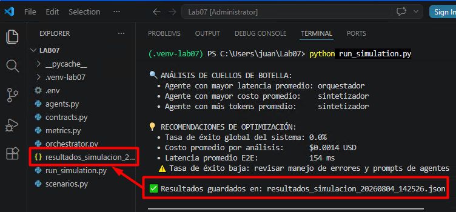

# Práctica 7 — Simular Arquitectura Multi-Agente y Analizar Resultados

## Metadatos

| Campo | Valor |
|---|---|
| **Duración estimada** | 46 minutos |
| **Nivel Bloom** | Aplicar |

---

## Descripción General

En este laboratorio implementarás un sistema multi-agente de análisis de propuestas de negocio utilizando **CrewAI 0.70.x**. El sistema estará compuesto por cuatro agentes con roles diferenciados: un orquestador, un especialista financiero, un especialista en riesgos y un agente de síntesis. Definirás contratos A2A (Agent-to-Agent) con Pydantic para estructurar los mensajes entre agentes, implementarás mecanismos anti-loop y recolectarás métricas de calidad, latencia, costo de tokens y tasa de éxito. El laboratorio culmina con un análisis comparativo de tres escenarios de prueba usando pandas, aplicando directamente los conceptos de métricas estudiados en la Lección 7.1.

---

## Objetivos de Aprendizaje

Al finalizar este laboratorio serás capaz de:

- [ ] Diseñar e implementar una arquitectura multi-agente con roles diferenciados (orquestador, especialistas, síntesis) usando CrewAI con handoffs estructurados
- [ ] Definir contratos A2A con Pydantic que validen esquemas de mensajes y prevengan loops infinitos mediante contadores de iteración y timeouts
- [ ] Instrumentar cada agente para recolectar métricas de calidad, latencia, costo de tokens y tasa de éxito siguiendo el marco de la Lección 7.1
- [ ] Analizar resultados de tres escenarios de prueba con pandas, identificando cuellos de botella y oportunidades de optimización

---

## Prerrequisitos

### Conocimiento previo
- Haber completado Labs 03-00-01, 04-00-01 y 05-00-01
- Comprensión de patrones ReAct y planner-executor
- Familiaridad con Pydantic v2 para validación de esquemas
- Conceptos de métricas agénticas (Lección 7.1): calidad, latencia, costo, tasa de éxito y seguridad

---

## Entorno del Laboratorio

### Requisitos de hardware

| Componente | Mínimo | Recomendado |
|---|---|---|
| CPU | 4 núcleos | 8 núcleos |
| RAM | 16 GB | 32 GB |
| Almacenamiento libre | 2 GB | 5 GB |
| Red | 10 Mbps | 25 Mbps |

### Dependencias de software

| Paquete | Versión |
|---|---|
| `crewai` | 0.70.x |
| `openai` | 1.40.x |
| `pydantic` | 2.8.x |
| `langsmith` | 0.1.x |
| `fastapi` | 0.115.x |
| `uvicorn` | 0.30.x |
| `structlog` | 24.x |
| `pandas` | 2.x |
| `python-dotenv` | 1.x |

### Configuración del entorno

```bash
# 1. Crear directorio del laboratorio
cd ~
mkdir Lab07
cd Lab07
python -m venv .venv-lab07

# 3. Activar entorno virtual
.\.venv\Scripts\Activate.ps1

# 4. Instalar dependencias
python.exe -m pip install --upgrade pip

pip install --only-binary=:all: crewai==0.70.0 openai==1.40.0 pydantic==2.8.0 langsmith==0.1.147 fastapi==0.115.0 uvicorn==0.30.0 structlog==24.4.0 pandas==2.2.0 python-dotenv==1.0.1 tabulate==0.9.0

pip install httpx==0.27.2
pip install --upgrade litellm openai crewai google-genai

# 5. Verificar instalaciones clave
python -c "import crewai; print('CrewAI:', crewai.__version__)"
python -c "import pydantic; print('Pydantic:', pydantic.__version__)"
```

### Archivo de variables de entorno

Copia el archivo .env del laboratorio 3

```powershell
cp ~/Lab03/.env ./
```
Modifícalo, agregando las siguientes líneas al final. También cambia el valor de **LANGSMITH_TRACING** por false, así como se muestra aquí:

```bash
LANGSMITH_TRACING=false ## Tu archivo original debe tener el valor true, cámbialo a false
MAX_ITERATIONS=5
TASK_TIMEOUT_SECONDS=120
```

> ⚠️ **Advertencia de privacidad**: Nunca incluyas datos reales de personas. Todos los datos de prueba en este lab son sintéticos.

---

## Instrucciones Paso a Paso

---

### Paso 1 — Definir los Contratos A2A con Pydantic

**Objetivo:** Establecer los esquemas de mensajes validados que los agentes usarán para comunicarse, incluyendo mecanismos anti-loop.

#### Instrucciones

1. Crea el archivo `contracts.py` en `lab07/`:

```python
# contracts.py
"""
Contratos A2A (Agent-to-Agent) para el sistema multi-agente.
Define los esquemas de mensajes validados entre agentes con
mecanismos anti-loop y control de iteraciones.
"""

from __future__ import annotations
from datetime import datetime
from enum import Enum
from typing import Optional
from pydantic import BaseModel, Field, field_validator


# ─── Enumeraciones de estado ─────────────────────────────────────────────────

class EstadoTarea(str, Enum):
    PENDIENTE = "pendiente"
    EN_PROCESO = "en_proceso"
    COMPLETADO = "completado"
    FALLIDO = "fallido"
    ESCALADO = "escalado"


class NivelComplejidad(str, Enum):
    BAJA = "baja"
    MEDIA = "media"
    ALTA = "alta"


class RolAgente(str, Enum):
    ORQUESTADOR = "orquestador"
    ANALISTA_FINANCIERO = "analista_financiero"
    ANALISTA_RIESGOS = "analista_riesgos"
    SINTETIZADOR = "sintetizador"


# ─── Contrato de Solicitud de Análisis (Entrada al sistema) ──────────────────

class SolicitudAnalisis(BaseModel):
    """Contrato de entrada: solicitud de análisis de propuesta de negocio."""
    id_solicitud: str = Field(..., description="Identificador único de la solicitud")
    titulo_propuesta: str = Field(..., min_length=5, max_length=200)
    descripcion: str = Field(..., min_length=20, max_length=2000)
    monto_inversion_usd: float = Field(..., gt=0, description="Inversión requerida en USD")
    industria: str = Field(..., description="Sector industrial de la propuesta")
    horizonte_meses: int = Field(..., ge=1, le=120, description="Horizonte temporal en meses")
    complejidad: NivelComplejidad = NivelComplejidad.MEDIA
    timestamp: datetime = Field(default_factory=datetime.utcnow)
    iteracion_actual: int = Field(default=0, ge=0)
    max_iteraciones: int = Field(default=5, ge=1, le=10)

    @field_validator("iteracion_actual")
    @classmethod
    def validar_iteracion(cls, v: int, info) -> int:
        # Acceso seguro a max_iteraciones desde el contexto de validación
        return v


# ─── Contrato de Análisis Financiero ─────────────────────────────────────────

class AnalisisFinanciero(BaseModel):
    """Resultado del agente especialista en análisis financiero."""
    id_solicitud: str
    agente_origen: RolAgente = RolAgente.ANALISTA_FINANCIERO
    roi_estimado_pct: float = Field(..., description="ROI estimado en porcentaje")
    periodo_recuperacion_meses: int = Field(..., ge=0)
    flujo_caja_proyectado: list[float] = Field(
        ..., min_length=1, description="Flujo de caja mensual proyectado"
    )
    viabilidad_financiera: bool
    puntuacion_financiera: float = Field(..., ge=0.0, le=10.0)
    observaciones: str
    confianza: float = Field(..., ge=0.0, le=1.0, description="Nivel de confianza 0-1")
    tokens_consumidos: int = Field(default=0, ge=0)
    latencia_ms: float = Field(default=0.0, ge=0.0)
    timestamp: datetime = Field(default_factory=datetime.utcnow)


# ─── Contrato de Análisis de Riesgos ─────────────────────────────────────────

class AnalisisRiesgos(BaseModel):
    """Resultado del agente especialista en análisis de riesgos."""
    id_solicitud: str
    agente_origen: RolAgente = RolAgente.ANALISTA_RIESGOS
    nivel_riesgo_global: str = Field(..., pattern="^(bajo|medio|alto|critico)$")
    riesgos_identificados: list[str] = Field(..., min_length=1)
    mitigaciones_propuestas: list[str] = Field(..., min_length=1)
    puntuacion_riesgo: float = Field(..., ge=0.0, le=10.0)
    probabilidad_fracaso_pct: float = Field(..., ge=0.0, le=100.0)
    observaciones: str
    confianza: float = Field(..., ge=0.0, le=1.0)
    tokens_consumidos: int = Field(default=0, ge=0)
    latencia_ms: float = Field(default=0.0, ge=0.0)
    timestamp: datetime = Field(default_factory=datetime.utcnow)


# ─── Contrato de Síntesis Final ───────────────────────────────────────────────

class InformeSintesis(BaseModel):
    """Informe consolidado generado por el agente sintetizador."""
    id_solicitud: str
    agente_origen: RolAgente = RolAgente.SINTETIZADOR
    recomendacion_final: str = Field(
        ..., pattern="^(aprobar|rechazar|revisar|posponer)$"
    )
    puntuacion_global: float = Field(..., ge=0.0, le=10.0)
    resumen_ejecutivo: str = Field(..., min_length=50)
    puntos_clave: list[str] = Field(..., min_length=3)
    proximos_pasos: list[str] = Field(..., min_length=1)
    estado_final: EstadoTarea = EstadoTarea.COMPLETADO
    tokens_consumidos: int = Field(default=0, ge=0)
    latencia_ms: float = Field(default=0.0, ge=0.0)
    timestamp: datetime = Field(default_factory=datetime.utcnow)


# ─── Registro de Métricas por Agente ─────────────────────────────────────────

class MetricasAgente(BaseModel):
    """Registro de métricas de desempeño por agente (Lección 7.1)."""
    nombre_agente: str
    rol: RolAgente
    tokens_entrada: int = 0
    tokens_salida: int = 0
    latencia_ms: float = 0.0
    llamadas_llm: int = 0
    tasa_exito: float = 0.0      # 0.0 - 1.0
    puntuacion_calidad: float = 0.0  # 0.0 - 10.0
    costo_usd: float = 0.0
    estado: EstadoTarea = EstadoTarea.PENDIENTE
    errores: list[str] = Field(default_factory=list)

    # Precios GPT-4o-mini (USD por 1K tokens)
    PRECIO_INPUT_POR_1K: float = 0.000150
    PRECIO_OUTPUT_POR_1K: float = 0.000600

    def calcular_costo(self) -> float:
        """Calcula el costo total según fórmula de Lección 7.1."""
        costo = (
            (self.tokens_entrada / 1000) * self.PRECIO_INPUT_POR_1K +
            (self.tokens_salida / 1000) * self.PRECIO_OUTPUT_POR_1K
        )
        self.costo_usd = round(costo, 6)
        return self.costo_usd
```

2. Verifica que los contratos se importan correctamente:

```bash
python -c "from contracts import SolicitudAnalisis, AnalisisFinanciero, AnalisisRiesgos, InformeSintesis, MetricasAgente; print('Contratos A2A cargados correctamente')"
```

#### Salida Esperada

```
Contratos A2A cargados correctamente
```

#### Verificación

```bash
python -c "
from contracts import SolicitudAnalisis, NivelComplejidad
s = SolicitudAnalisis(
    id_solicitud='TEST-001',
    titulo_propuesta='Plataforma de e-commerce B2B',
    descripcion='Sistema de comercio electrónico para empresas medianas con integración ERP',
    monto_inversion_usd=500000,
    industria='tecnologia',
    horizonte_meses=24,
    complejidad=NivelComplejidad.MEDIA
)
print('Solicitud válida:', s.id_solicitud)
print('Iteración actual:', s.iteracion_actual, '/', s.max_iteraciones)
"
```

---

### Paso 2 — Implementar el Monitor de Métricas

**Objetivo:** Crear el sistema de instrumentación que recolecta métricas de calidad, latencia, costo y tasa de éxito por agente, siguiendo el marco definido en la Lección 7.1.

#### Instrucciones

1. Crea el archivo `metrics.py`:

```python
# metrics.py
"""
Monitor de métricas para el sistema multi-agente.
Implementa las cinco categorías de métricas de la Lección 7.1:
calidad, latencia, costo, tasa de éxito y seguridad.
"""

import time
import json
from contextlib import contextmanager
from datetime import datetime
from typing import Optional
import structlog
import pandas as pd
from contracts import MetricasAgente, RolAgente, EstadoTarea

# Configurar structlog para logging estructurado
structlog.configure(
    processors=[
        structlog.processors.TimeStamper(fmt="iso"),
        structlog.processors.add_log_level,
        structlog.processors.JSONRenderer()
    ]
)
logger = structlog.get_logger()


class MonitorMetricas:
    """
    Recolector centralizado de métricas del sistema multi-agente.
    Basado en el marco de 5 dimensiones de la Lección 7.1.
    """

    # Precios GPT-4o-mini (USD por 1K tokens) - Lección 7.1
    PRECIO_INPUT_POR_1K = 0.000150
    PRECIO_OUTPUT_POR_1K = 0.000600

    def __init__(self, id_sesion: str):
        self.id_sesion = id_sesion
        self.inicio_sesion = time.perf_counter()
        self.metricas_por_agente: dict[str, MetricasAgente] = {}
        self.registro_eventos: list[dict] = []
        self.iteraciones_sistema = 0
        self.max_iteraciones = int(__import__('os').getenv('MAX_ITERATIONS', '5'))

    # ─── Gestión de agentes ──────────────────────────────────────────────────

    def registrar_agente(self, nombre: str, rol: RolAgente):
        """Registra un agente en el monitor."""
        self.metricas_por_agente[nombre] = MetricasAgente(
            nombre_agente=nombre,
            rol=rol
        )
        logger.info("agente_registrado", nombre=nombre, rol=rol.value)

    # ─── Context manager para medir latencia ────────────────────────────────

    @contextmanager
    def medir_latencia(self, nombre_agente: str):
        """
        Context manager para medir latencia de un agente.
        Implementa la métrica de latencia de la Lección 7.1.
        """
        inicio = time.perf_counter()
        try:
            yield
        finally:
            duracion_ms = (time.perf_counter() - inicio) * 1000
            if nombre_agente in self.metricas_por_agente:
                self.metricas_por_agente[nombre_agente].latencia_ms += duracion_ms
            self._registrar_evento("latencia_medida", {
                "agente": nombre_agente,
                "duracion_ms": round(duracion_ms, 2)
            })

    # ─── Registro de tokens y costo ─────────────────────────────────────────

    def registrar_uso_tokens(
        self,
        nombre_agente: str,
        tokens_entrada: int,
        tokens_salida: int
    ):
        """
        Registra consumo de tokens y calcula costo.
        Fórmula de la Lección 7.1:
        Costo = (tokens_entrada × precio_entrada) + (tokens_salida × precio_salida)
        """
        if nombre_agente not in self.metricas_por_agente:
            return

        m = self.metricas_por_agente[nombre_agente]
        m.tokens_entrada += tokens_entrada
        m.tokens_salida += tokens_salida
        m.llamadas_llm += 1

        # Calcular costo acumulado
        costo = (
            (m.tokens_entrada / 1000) * self.PRECIO_INPUT_POR_1K +
            (m.tokens_salida / 1000) * self.PRECIO_OUTPUT_POR_1K
        )
        m.costo_usd = round(costo, 6)

        logger.info("tokens_registrados", agente=nombre_agente,
                    entrada=tokens_entrada, salida=tokens_salida,
                    costo_usd=m.costo_usd)

    # ─── Registro de calidad y éxito ─────────────────────────────────────────

    def registrar_resultado(
        self,
        nombre_agente: str,
        exito: bool,
        puntuacion_calidad: float,
        error: Optional[str] = None
    ):
        """Registra el resultado de un agente (éxito/fallo y calidad)."""
        if nombre_agente not in self.metricas_por_agente:
            return

        m = self.metricas_por_agente[nombre_agente]
        m.tasa_exito = 1.0 if exito else 0.0
        m.puntuacion_calidad = puntuacion_calidad
        m.estado = EstadoTarea.COMPLETADO if exito else EstadoTarea.FALLIDO

        if error:
            m.errores.append(error)

        logger.info("resultado_registrado", agente=nombre_agente,
                    exito=exito, calidad=puntuacion_calidad)

    # ─── Control anti-loop ───────────────────────────────────────────────────

    def verificar_limite_iteraciones(self) -> bool:
        """
        Verifica si se ha alcanzado el límite de iteraciones del sistema.
        Mecanismo anti-loop de la Lección 7.1.
        Retorna True si se puede continuar, False si se debe detener.
        """
        self.iteraciones_sistema += 1
        if self.iteraciones_sistema > self.max_iteraciones:
            logger.warning("limite_iteraciones_alcanzado",
                           iteraciones=self.iteraciones_sistema,
                           maximo=self.max_iteraciones)
            return False
        return True

    # ─── Generación de reporte ───────────────────────────────────────────────

    def generar_dataframe(self) -> pd.DataFrame:
        """Genera un DataFrame pandas con todas las métricas recolectadas."""
        registros = []
        for nombre, m in self.metricas_por_agente.items():
            registros.append({
                "agente": nombre,
                "rol": m.rol.value,
                "tokens_entrada": m.tokens_entrada,
                "tokens_salida": m.tokens_salida,
                "tokens_total": m.tokens_entrada + m.tokens_salida,
                "latencia_ms": round(m.latencia_ms, 2),
                "llamadas_llm": m.llamadas_llm,
                "tasa_exito": m.tasa_exito,
                "puntuacion_calidad": m.puntuacion_calidad,
                "costo_usd": m.costo_usd,
                "estado": m.estado.value,
                "num_errores": len(m.errores)
            })
        return pd.DataFrame(registros)

    def costo_total_sistema(self) -> float:
        """Retorna el costo total del sistema (suma de todos los agentes)."""
        return sum(m.costo_usd for m in self.metricas_por_agente.values())

    def latencia_total_ms(self) -> float:
        """Retorna la latencia total E2E del sistema."""
        return (time.perf_counter() - self.inicio_sesion) * 1000

    def _registrar_evento(self, tipo: str, datos: dict):
        """Registra un evento en el log interno."""
        self.registro_eventos.append({
            "tipo": tipo,
            "timestamp": datetime.utcnow().isoformat(),
            **datos
        })

    def imprimir_resumen(self):
        """Imprime un resumen de métricas en consola."""
        df = self.generar_dataframe()
        print("\n" + "="*70)
        print(f"RESUMEN DE MÉTRICAS — Sesión: {self.id_sesion}")
        print("="*70)
        if not df.empty:
            print(df.to_string(index=False))
            print("-"*70)
            print(f"Costo total sistema:   ${self.costo_total_sistema():.6f} USD")
            print(f"Latencia E2E total:    {self.latencia_total_ms():.0f} ms")
            print(f"Iteraciones sistema:   {self.iteraciones_sistema}")
        print("="*70 + "\n")
```

2. Verifica el monitor:

```bash
python -c "
from metrics import MonitorMetricas
from contracts import RolAgente
m = MonitorMetricas('TEST-SESION-001')
m.registrar_agente('orquestador', RolAgente.ORQUESTADOR)
m.registrar_uso_tokens('orquestador', 500, 200)
m.registrar_resultado('orquestador', True, 8.5)
m.imprimir_resumen()
"
```

#### Salida Esperada

```
======================================================================
RESUMEN DE MÉTRICAS — Sesión: TEST-SESION-001
======================================================================
      agente          rol  tokens_entrada  ...  costo_usd  estado  num_errores
 orquestador  orquestador             500  ...   0.000195  completado          0
----------------------------------------------------------------------
Costo total sistema:   $0.000195 USD
Latencia E2E total:    X ms
Iteraciones sistema:   0
======================================================================
```

#### Verificación

```bash
python -c "
from metrics import MonitorMetricas
from contracts import RolAgente
m = MonitorMetricas('VERIFY-001')
# Probar mecanismo anti-loop
m.max_iteraciones = 3
for i in range(5):
    puede_continuar = m.verificar_limite_iteraciones()
    print(f'Iteración {i+1}: puede_continuar={puede_continuar}')
"
```

---

### Paso 3 — Construir los Agentes Especializados con CrewAI

**Objetivo:** Implementar los cuatro agentes del sistema usando CrewAI, con roles, objetivos y backstories diferenciados.

#### Instrucciones

1. Crea el archivo `agents.py`:

```python
# agents.py
"""
Definición de los agentes especializados del sistema multi-agente.
Arquitectura: Orquestador → Analista Financiero + Analista Riesgos → Sintetizador
"""

import os
import time
import json
from dotenv import load_dotenv
from crewai import Agent, Task, Crew, Process, LLM
from crewai.tools import BaseTool  # <--- CAMBIO AQUÍ: Importamos BaseTool desde crewai.tools
from pydantic import BaseModel, Field
from contracts import (
    SolicitudAnalisis, AnalisisFinanciero, AnalisisRiesgos,
    InformeSintesis, RolAgente, NivelComplejidad
)
from metrics import MonitorMetricas

load_dotenv()

# ─── Configuración del modelo Azure OpenAI ────────────────────────────────────

# Instancia global del LLM de Azure OpenAI configurada desde las variables de entorno
azure_llm = LLM(
    model=f"azure/{os.getenv('AZURE_OPENAI_DEPLOYMENT', 'gpt-5-mini')}",
    api_key=os.getenv("AZURE_OPENAI_KEY"),
    api_base=os.getenv("AZURE_OPENAI_ENDPOINT"),
    api_version=os.getenv("AZURE_OPENAI_API_VERSION", "2024-02-01")
)

# ─── Herramientas de los agentes ─────────────────────────────────────────────

class CalculadoraFinancieraInput(BaseModel):
    monto_inversion: float
    horizonte_meses: int
    tasa_crecimiento_anual: float = 0.15

class CalculadoraFinanciera(BaseTool):
    """Herramienta de cálculo financiero para el agente especialista."""
    name: str = "calculadora_financiera"
    description: str = (
        "Calcula ROI, período de recuperación y flujo de caja proyectado "
        "dado un monto de inversión, horizonte temporal y tasa de crecimiento."
    )
    args_schema: type[BaseModel] = CalculadoraFinancieraInput

    def _run(self, monto_inversion: float, horizonte_meses: int,
             tasa_crecimiento_anual: float = 0.15) -> str:
        tasa_mensual = tasa_crecimiento_anual / 12
        flujo = []
        ingresos_acumulados = 0
        periodo_recuperacion = horizonte_meses  # Pesimista por defecto

        for mes in range(1, horizonte_meses + 1):
            ingreso_mes = monto_inversion * tasa_mensual * (1 + tasa_mensual) ** mes
            flujo.append(round(ingreso_mes, 2))
            ingresos_acumulados += ingreso_mes
            if ingresos_acumulados >= monto_inversion and periodo_recuperacion == horizonte_meses:
                periodo_recuperacion = mes

        roi = ((ingresos_acumulados - monto_inversion) / monto_inversion) * 100

        return json.dumps({
            "roi_pct": round(roi, 2),
            "periodo_recuperacion_meses": periodo_recuperacion,
            "flujo_primeros_6_meses": flujo[:6],
            "ingresos_totales_proyectados": round(ingresos_acumulados, 2)
        })


class EvaluadorRiesgosInput(BaseModel):
    industria: str
    monto_inversion: float
    horizonte_meses: int
    complejidad: str

class EvaluadorRiesgos(BaseTool):
    """Herramienta de evaluación de riesgos para el agente especialista."""
    name: str = "evaluador_riesgos"
    description: str = (
        "Evalúa el perfil de riesgos de una propuesta de negocio "
        "considerando industria, inversión, horizonte y complejidad."
    )
    args_schema: type[BaseModel] = EvaluadorRiesgosInput

    def _run(self, industria: str, monto_inversion: float,
             horizonte_meses: int, complejidad: str) -> str:
        # Lógica simplificada de evaluación de riesgos
        riesgos_base = {
            "tecnologia": ["obsolescencia tecnológica", "ciberseguridad", "talento escaso"],
            "retail": ["competencia e-commerce", "márgenes reducidos", "logística"],
            "manufactura": ["costos materia prima", "regulaciones ambientales", "automatización"],
            "default": ["riesgo de mercado", "riesgo operacional", "riesgo financiero"]
        }

        riesgos = riesgos_base.get(industria.lower(), riesgos_base["default"])

        # Puntuación de riesgo basada en parámetros
        puntuacion = 5.0
        if monto_inversion > 1_000_000:
            puntuacion += 1.5
        if horizonte_meses > 36:
            puntuacion += 1.0
        if complejidad == "alta":
            puntuacion += 2.0
        elif complejidad == "baja":
            puntuacion -= 1.0

        puntuacion = min(10.0, max(0.0, puntuacion))
        nivel = "bajo" if puntuacion < 4 else "medio" if puntuacion < 6 else "alto" if puntuacion < 8 else "critico"

        return json.dumps({
            "nivel_riesgo": nivel,
            "puntuacion_riesgo": round(puntuacion, 1),
            "riesgos_identificados": riesgos,
            "probabilidad_fracaso_pct": round(puntuacion * 8, 1),
            "mitigaciones": [f"Mitigar: {r}" for r in riesgos]
        })


# ─── Fábrica de Agentes CrewAI ───────────────────────────────────────────────

def crear_agente_orquestador() -> Agent:
    """Crea el agente orquestador que coordina el análisis."""
    return Agent(
        role="Orquestador de Análisis de Propuestas",
        goal=(
            "Coordinar el análisis completo de propuestas de negocio, "
            "delegando tareas a los especialistas apropiados y asegurando "
            "que el análisis sea coherente, completo y entregado a tiempo."
        ),
        backstory=(
            "Eres un director de inversiones con 20 años de experiencia "
            "coordinando equipos de analistas. Tu fortaleza es identificar "
            "qué aspectos de una propuesta requieren análisis especializado "
            "y sintetizar perspectivas diversas en decisiones claras."
        ),
        verbose=True,
        allow_delegation=True,
        max_iter=int(os.getenv("MAX_ITERATIONS", "5")),
        llm=azure_llm
    )


def crear_agente_financiero() -> Agent:
    """Crea el agente especialista en análisis financiero."""
    return Agent(
        role="Analista Financiero Especialista",
        goal=(
            "Evaluar la viabilidad financiera de propuestas de negocio, "
            "calculando ROI, flujo de caja, período de recuperación y "
            "proporcionando una puntuación financiera objetiva."
        ),
        backstory=(
            "Eres un analista financiero certificado (CFA) especializado "
            "en evaluación de proyectos de inversión. Has evaluado más de "
            "500 propuestas de negocio y tu metodología combina análisis "
            "cuantitativo riguroso con comprensión del contexto de mercado."
        ),
        tools=[CalculadoraFinanciera()],
        verbose=True,
        allow_delegation=False,
        max_iter=int(os.getenv("MAX_ITERATIONS", "5")),
        llm=azure_llm
    )


def crear_agente_riesgos() -> Agent:
    """Crea el agente especialista en análisis de riesgos."""
    return Agent(
        role="Analista de Riesgos Especialista",
        goal=(
            "Identificar, cuantificar y proponer mitigaciones para los riesgos "
            "asociados a propuestas de negocio, entregando una evaluación "
            "estructurada con nivel de riesgo global y recomendaciones concretas."
        ),
        backstory=(
            "Eres un gestor de riesgos empresariales con certificación PRM "
            "y experiencia en sectores tecnológico, financiero e industrial. "
            "Tu enfoque sistemático identifica riesgos que otros analistas "
            "pasan por alto, especialmente en entornos de alta incertidumbre."
        ),
        tools=[EvaluadorRiesgos()],
        verbose=True,
        allow_delegation=False,
        max_iter=int(os.getenv("MAX_ITERATIONS", "5")),
        llm=azure_llm
    )


def crear_agente_sintetizador() -> Agent:
    """Crea el agente sintetizador que consolida los análisis."""
    return Agent(
        role="Sintetizador de Análisis y Decisiones",
        goal=(
            "Consolidar los análisis financiero y de riesgos en un informe "
            "ejecutivo coherente, formulando una recomendación final clara "
            "(aprobar/rechazar/revisar/posponer) con justificación sólida."
        ),
        backstory=(
            "Eres un consultor estratégico senior que transforma análisis "
            "técnicos complejos en narrativas ejecutivas accionables. "
            "Tu valor reside en identificar la tensión entre retorno y riesgo "
            "y articularla de forma que facilite la toma de decisiones."
        ),
        verbose=True,
        allow_delegation=False,
        max_iter=int(os.getenv("MAX_ITERATIONS", "5")),
        llm=azure_llm
    )
```

2. Verifica la creación de agentes:

```bash
python -c "
from agents import crear_agente_orquestador, crear_agente_financiero
ag_orch = crear_agente_orquestador()
ag_fin = crear_agente_financiero()
print('Orquestador creado:', ag_orch.role)
print('Analista financiero creado:', ag_fin.role)
print('Herramientas del analista:', [t.name for t in ag_fin.tools])
"
```

#### Salida Esperada

```
Orquestador creado: Orquestador de Análisis de Propuestas
Analista financiero creado: Analista Financiero Especialista
Herramientas del analista: ['calculadora_financiera']
```

#### Verificación

```bash
python -c "
from agents import CalculadoraFinanciera, EvaluadorRiesgos
import json
# Probar herramienta financiera
calc = CalculadoraFinanciera()
resultado = calc._run(500000, 24, 0.15)
datos = json.loads(resultado)
print('ROI calculado:', datos['roi_pct'], '%')
print('Período recuperación:', datos['periodo_recuperacion_meses'], 'meses')
# Probar herramienta de riesgos
eval_r = EvaluadorRiesgos()
riesgo = json.loads(eval_r._run('tecnologia', 500000, 24, 'media'))
print('Nivel riesgo:', riesgo['nivel_riesgo'])
"
```

---

### Paso 4 — Implementar el Orquestador y las Tareas CrewAI

**Objetivo:** Definir las tareas del sistema y el flujo de ejecución con handoffs estructurados entre agentes.

#### Instrucciones

1. Crea el archivo `orchestrator.py`:

```python
# orchestrator.py
"""
Orquestador principal del sistema multi-agente.
Define las tareas CrewAI con dependencias explícitas y
ejecuta el flujo con instrumentación de métricas completa.
"""

import os
import time
import uuid
from datetime import datetime
from dotenv import load_dotenv
from crewai import Task, Crew, Process
from contracts import (
    SolicitudAnalisis, NivelComplejidad, RolAgente, EstadoTarea
)
from agents import (
    crear_agente_orquestador,
    crear_agente_financiero,
    crear_agente_riesgos,
    crear_agente_sintetizador
)
from metrics import MonitorMetricas

load_dotenv()


def construir_tareas(solicitud: SolicitudAnalisis, agentes: dict) -> list[Task]:
    """
    Construye las tareas del sistema con dependencias explícitas.
    El orden define el flujo de handoffs entre agentes.
    """

    # Tarea 1: Análisis financiero
    tarea_financiera = Task(
        description=f"""
        Analiza la viabilidad financiera de la siguiente propuesta de negocio:

        **Título:** {solicitud.titulo_propuesta}
        **Descripción:** {solicitud.descripcion}
        **Inversión requerida:** ${solicitud.monto_inversion_usd:,.2f} USD
        **Industria:** {solicitud.industria}
        **Horizonte:** {solicitud.horizonte_meses} meses
        **Complejidad:** {solicitud.complejidad.value}

        Usa la herramienta calculadora_financiera con los parámetros de la propuesta.
        Proporciona:
        1. ROI estimado (%)
        2. Período de recuperación (meses)
        3. Flujo de caja proyectado (primeros 6 meses)
        4. Viabilidad financiera (sí/no con justificación)
        5. Puntuación financiera del 1 al 10
        6. Nivel de confianza (0.0 a 1.0)

        Sé específico y cuantitativo en tu análisis.
        """,
        expected_output=(
            "Análisis financiero completo con ROI, período de recuperación, "
            "flujo de caja, viabilidad (booleano), puntuación 1-10 y nivel de confianza."
        ),
        agent=agentes["financiero"]
    )

    # Tarea 2: Análisis de riesgos (puede ejecutarse en paralelo con tarea_financiera)
    tarea_riesgos = Task(
        description=f"""
        Evalúa los riesgos de la siguiente propuesta de negocio:

        **Título:** {solicitud.titulo_propuesta}
        **Descripción:** {solicitud.descripcion}
        **Inversión:** ${solicitud.monto_inversion_usd:,.2f} USD
        **Industria:** {solicitud.industria}
        **Horizonte:** {solicitud.horizonte_meses} meses
        **Complejidad:** {solicitud.complejidad.value}

        Usa la herramienta evaluador_riesgos con los parámetros de la propuesta.
        Proporciona:
        1. Nivel de riesgo global (bajo/medio/alto/critico)
        2. Lista de al menos 3 riesgos identificados
        3. Mitigaciones propuestas para cada riesgo
        4. Puntuación de riesgo del 1 al 10
        5. Probabilidad de fracaso estimada (%)
        6. Nivel de confianza (0.0 a 1.0)
        """,
        expected_output=(
            "Evaluación de riesgos con nivel global, lista de riesgos, "
            "mitigaciones, puntuación 1-10, probabilidad de fracaso y confianza."
        ),
        agent=agentes["riesgos"]
    )

    # Tarea 3: Síntesis (depende de tarea_financiera y tarea_riesgos)
    tarea_sintesis = Task(
        description=f"""
        Consolida los análisis financiero y de riesgos en un informe ejecutivo
        para la propuesta: **{solicitud.titulo_propuesta}**

        Con base en los análisis previos de tus colegas especialistas, elabora:

        1. **Recomendación final**: aprobar / rechazar / revisar / posponer
           (elige UNA de estas cuatro opciones exactamente)
        2. **Puntuación global** del 1 al 10 (ponderando finanzas y riesgos)
        3. **Resumen ejecutivo** (mínimo 3 oraciones, máximo 5)
        4. **Puntos clave** (lista de exactamente 4 puntos)
        5. **Próximos pasos** (lista de 2-3 acciones concretas)

        La recomendación debe balancear el potencial financiero con el perfil
        de riesgos. Sé directo y accionable.
        """,
        expected_output=(
            "Informe ejecutivo con recomendación (aprobar/rechazar/revisar/posponer), "
            "puntuación global, resumen ejecutivo, puntos clave y próximos pasos."
        ),
        agent=agentes["sintetizador"],
        context=[tarea_financiera, tarea_riesgos]
    )

    return [tarea_financiera, tarea_riesgos, tarea_sintesis]


def ejecutar_analisis(
    solicitud: SolicitudAnalisis,
    monitor: MonitorMetricas
) -> dict:
    """
    Ejecuta el análisis multi-agente completo con instrumentación de métricas.
    Retorna un diccionario con los resultados y métricas recolectadas.
    """
    print(f"\n{'='*60}")
    print(f"Iniciando análisis: {solicitud.titulo_propuesta}")
    print(f"ID: {solicitud.id_solicitud} | Complejidad: {solicitud.complejidad.value}")
    print(f"{'='*60}\n")

    # Verificar límite de iteraciones (anti-loop)
    if not monitor.verificar_limite_iteraciones():
        return {
            "exito": False,
            "error": "Límite de iteraciones del sistema alcanzado",
            "estado": EstadoTarea.FALLIDO.value
        }

    # Crear agentes
    agentes = {
        "orquestador": crear_agente_orquestador(),
        "financiero": crear_agente_financiero(),
        "riesgos": crear_agente_riesgos(),
        "sintetizador": crear_agente_sintetizador()
    }

    # Registrar agentes en el monitor
    for nombre, rol in [
        ("orquestador", RolAgente.ORQUESTADOR),
        ("financiero", RolAgente.ANALISTA_FINANCIERO),
        ("riesgos", RolAgente.ANALISTA_RIESGOS),
        ("sintetizador", RolAgente.SINTETIZADOR)
    ]:
        monitor.registrar_agente(nombre, rol)

    # Construir tareas
    tareas = construir_tareas(solicitud, agentes)

    # Crear y configurar el Crew
    crew = Crew(
        agents=list(agentes.values()),
        tasks=tareas,
        process=Process.sequential,
        verbose=True,
        max_rpm=10  # Límite de requests por minuto
    )

    # Ejecutar con medición de latencia E2E
    inicio_total = time.perf_counter()
    resultado_crew = None
    exito = False
    error_msg = None

    try:
        with monitor.medir_latencia("orquestador"):
            resultado_crew = crew.kickoff()
        exito = True

    except Exception as e:
        error_msg = str(e)
        print(f"\n⚠️  Error durante la ejecución: {error_msg}")

    latencia_total = (time.perf_counter() - inicio_total) * 1000

    # Registrar métricas aproximadas por agente
    # (CrewAI no expone tokens por agente directamente; se estiman por tarea)
    tokens_estimados = {
        "financiero": (800, 400),    # (entrada, salida) estimados
        "riesgos": (700, 350),
        "sintetizador": (1200, 600),
        "orquestador": (500, 200)
    }

    for nombre, (t_entrada, t_salida) in tokens_estimados.items():
        monitor.registrar_uso_tokens(nombre, t_entrada, t_salida)
        monitor.registrar_resultado(
            nombre,
            exito=exito,
            puntuacion_calidad=8.0 if exito else 0.0,
            error=error_msg
        )

    return {
        "exito": exito,
        "solicitud_id": solicitud.id_solicitud,
        "resultado_texto": str(resultado_crew) if resultado_crew else None,
        "latencia_total_ms": round(latencia_total, 2),
        "costo_estimado_usd": monitor.costo_total_sistema(),
        "error": error_msg,
        "estado": EstadoTarea.COMPLETADO.value if exito else EstadoTarea.FALLIDO.value
    }
```

2. Verifica la estructura del orquestador:

```bash
python -c "
from orchestrator import construir_tareas
from contracts import SolicitudAnalisis, NivelComplejidad
from agents import crear_agente_financiero, crear_agente_riesgos, crear_agente_sintetizador, crear_agente_orquestador
solicitud = SolicitudAnalisis(
    id_solicitud='VERIFY-002',
    titulo_propuesta='App de delivery de alimentos',
    descripcion='Plataforma móvil para conectar restaurantes locales con consumidores finales en ciudades medianas',
    monto_inversion_usd=250000,
    industria='tecnologia',
    horizonte_meses=18,
    complejidad=NivelComplejidad.MEDIA
)
agentes = {
    'orquestador': crear_agente_orquestador(),
    'financiero': crear_agente_financiero(),
    'riesgos': crear_agente_riesgos(),
    'sintetizador': crear_agente_sintetizador()
}
tareas = construir_tareas(solicitud, agentes)
print(f'Número de tareas creadas: {len(tareas)}')
for i, t in enumerate(tareas):
    print(f'  Tarea {i+1}: agente={t.agent.role[:30]}...')
"
```

#### Salida Esperada

```
Número de tareas creadas: 3
  Tarea 1: agente=Analista Financiero Especialista...
  Tarea 2: agente=Analista de Riesgos Especialista...
  Tarea 3: agente=Sintetizador de Análisis y Decisiones...
```

#### Verificación

```bash
python -c "
from orchestrator import construir_tareas
from contracts import SolicitudAnalisis, NivelComplejidad
from agents import crear_agente_financiero, crear_agente_riesgos, crear_agente_sintetizador, crear_agente_orquestador
solicitud = SolicitudAnalisis(
    id_solicitud='VERIFY-003',
    titulo_propuesta='Test de contexto en síntesis',
    descripcion='Verificar que la tarea de síntesis tiene contexto de las dos anteriores',
    monto_inversion_usd=100000,
    industria='tecnologia',
    horizonte_meses=12
)
agentes = {
    'orquestador': crear_agente_orquestador(),
    'financiero': crear_agente_financiero(),
    'riesgos': crear_agente_riesgos(),
    'sintetizador': crear_agente_sintetizador()
}
tareas = construir_tareas(solicitud, agentes)
tarea_sintesis = tareas[2]
print('Contexto de tarea síntesis:', len(tarea_sintesis.context), 'tareas previas')
assert len(tarea_sintesis.context) == 2, 'La síntesis debe depender de 2 tareas'
print('✓ Handoffs configurados correctamente')
"
```

---

### Paso 5 — Ejecutar los Tres Escenarios de Prueba

**Objetivo:** Ejecutar el sistema multi-agente con tres propuestas de diferente complejidad y recolectar métricas comparativas.

#### Instrucciones

1. Crea el archivo `scenarios.py`:

```python
# scenarios.py
"""
Definición de los tres escenarios de prueba para análisis comparativo.
Complejidad creciente: baja → media → alta.
Datos 100% sintéticos — NO usar datos reales de personas.
"""

from contracts import SolicitudAnalisis, NivelComplejidad

ESCENARIOS = [
    # ─── Escenario 1: Complejidad BAJA ───────────────────────────────────────
    SolicitudAnalisis(
        id_solicitud="ESC-001-BAJA",
        titulo_propuesta="Servicio de consultoría freelance en diseño gráfico",
        descripcion=(
            "Estudio independiente de diseño gráfico orientado a pequeñas empresas "
            "locales. Ofrece servicios de branding, diseño de materiales impresos "
            "y presencia digital básica. Operación unipersonal desde home office "
            "con herramientas de bajo costo. Mercado objetivo: 50 clientes anuales."
        ),
        monto_inversion_usd=15000,
        industria="servicios",
        horizonte_meses=12,
        complejidad=NivelComplejidad.BAJA
    ),

    # ─── Escenario 2: Complejidad MEDIA ──────────────────────────────────────
    SolicitudAnalisis(
        id_solicitud="ESC-002-MEDIA",
        titulo_propuesta="Plataforma SaaS de gestión de inventarios para retail",
        descripcion=(
            "Solución cloud de gestión de inventarios en tiempo real para cadenas "
            "de retail medianas (20-100 tiendas). Incluye módulos de predicción de "
            "demanda con ML, integración con sistemas POS y alertas automáticas de "
            "reabastecimiento. Modelo de negocio: suscripción mensual por tienda. "
            "Equipo inicial: 8 personas. Mercado objetivo: 200 clientes en 3 años."
        ),
        monto_inversion_usd=750000,
        industria="tecnologia",
        horizonte_meses=36,
        complejidad=NivelComplejidad.MEDIA
    ),

    # ─── Escenario 3: Complejidad ALTA ───────────────────────────────────────
    SolicitudAnalisis(
        id_solicitud="ESC-003-ALTA",
        titulo_propuesta="Planta de manufactura de baterías de litio para vehículos eléctricos",
        descripcion=(
            "Construcción y operación de una planta de manufactura de celdas de "
            "batería de litio-hierro-fosfato (LFP) para el mercado de vehículos "
            "eléctricos en Latinoamérica. Capacidad inicial: 500 MWh/año escalable "
            "a 2 GWh. Requiere permisos ambientales, cadena de suministro de litio "
            "local y acuerdos con fabricantes de vehículos. Horizonte de construcción "
            "24 meses, producción comercial mes 25. Riesgos regulatorios y geopolíticos "
            "significativos. Potencial de mercado: $500M USD en 5 años."
        ),
        monto_inversion_usd=45000000,
        industria="manufactura",
        horizonte_meses=84,
        complejidad=NivelComplejidad.ALTA
    )
]
```

2. Crea el archivo principal `run_simulation.py`:

```python
# run_simulation.py
"""
Script principal de simulación multi-agente.
Ejecuta los tres escenarios y genera el análisis comparativo.
"""

import os
import uuid
import json
import pandas as pd
from datetime import datetime
from dotenv import load_dotenv
from contracts import RolAgente
from metrics import MonitorMetricas
from orchestrator import ejecutar_analisis
from scenarios import ESCENARIOS

load_dotenv()


def ejecutar_simulacion_completa():
    """Ejecuta los tres escenarios y recolecta métricas comparativas."""

    print("\n" + "█"*65)
    print("  SIMULACIÓN MULTI-AGENTE — ANÁLISIS DE PROPUESTAS DE NEGOCIO")
    print("  Lab 07-00-01 | CrewAI + Métricas Lección 7.1")
    print("█"*65)

    resultados_globales = []
    dataframes_metricas = []

    for idx, escenario in enumerate(ESCENARIOS, 1):
        print(f"\n{'─'*65}")
        print(f"  ESCENARIO {idx}/3: {escenario.titulo_propuesta[:50]}")
        print(f"  Complejidad: {escenario.complejidad.value.upper()} | "
              f"Inversión: ${escenario.monto_inversion_usd:,.0f} USD")
        print(f"{'─'*65}")

        # Crear monitor de métricas para este escenario
        id_sesion = f"SIM-{escenario.id_solicitud}-{datetime.utcnow().strftime('%H%M%S')}"
        monitor = MonitorMetricas(id_sesion)

        # Ejecutar análisis
        resultado = ejecutar_analisis(escenario, monitor)

        # Imprimir resumen de métricas del escenario
        monitor.imprimir_resumen()

        # Recolectar datos para análisis comparativo
        df_escenario = monitor.generar_dataframe()
        df_escenario["escenario_id"] = escenario.id_solicitud
        df_escenario["complejidad"] = escenario.complejidad.value
        df_escenario["monto_inversion"] = escenario.monto_inversion_usd
        df_escenario["exito_sistema"] = resultado["exito"]
        df_escenario["latencia_e2e_ms"] = resultado["latencia_total_ms"]
        dataframes_metricas.append(df_escenario)

        resultados_globales.append({
            "escenario_id": escenario.id_solicitud,
            "titulo": escenario.titulo_propuesta[:40],
            "complejidad": escenario.complejidad.value,
            "monto_inversion_usd": escenario.monto_inversion_usd,
            "exito": resultado["exito"],
            "latencia_e2e_ms": resultado["latencia_total_ms"],
            "costo_total_usd": resultado["costo_estimado_usd"],
            "estado": resultado["estado"],
            "error": resultado.get("error", "")
        })

        print(f"\n  ✓ Escenario {idx} completado. "
              f"Éxito: {resultado['exito']} | "
              f"Latencia: {resultado['latencia_total_ms']:.0f}ms | "
              f"Costo: ${resultado['costo_estimado_usd']:.4f}")

    # ─── Análisis Comparativo ─────────────────────────────────────────────────
    print("\n\n" + "═"*65)
    print("  ANÁLISIS COMPARATIVO DE LOS TRES ESCENARIOS")
    print("  Aplicando marco de métricas de la Lección 7.1")
    print("═"*65)

    df_global = pd.concat(dataframes_metricas, ignore_index=True)
    df_resumen = pd.DataFrame(resultados_globales)

    # 1. Resumen por escenario
    print("\n📊 TABLA 1: Resumen de Resultados por Escenario")
    print(df_resumen[["escenario_id", "complejidad", "exito",
                       "latencia_e2e_ms", "costo_total_usd"]].to_string(index=False))

    # 2. Métricas por agente (promedio entre escenarios)
    print("\n📊 TABLA 2: Métricas Promedio por Agente")
    metricas_agente = df_global.groupby("agente").agg({
        "tokens_total": "mean",
        "latencia_ms": "mean",
        "puntuacion_calidad": "mean",
        "costo_usd": "mean",
        "tasa_exito": "mean"
    }).round(2)
    print(metricas_agente.to_string())

    # 3. Correlación complejidad-costo
    print("\n📊 TABLA 3: Relación Complejidad → Costo → Latencia")
    correlacion = df_resumen[["complejidad", "monto_inversion_usd",
                               "latencia_e2e_ms", "costo_total_usd"]].copy()
    print(correlacion.to_string(index=False))

    # 4. Identificación de cuellos de botella
    print("\n🔍 ANÁLISIS DE CUELLOS DE BOTELLA:")
    agente_mas_lento = df_global.groupby("agente")["latencia_ms"].mean().idxmax()
    agente_mas_caro = df_global.groupby("agente")["costo_usd"].mean().idxmax()
    agente_mas_tokens = df_global.groupby("agente")["tokens_total"].mean().idxmax()

    print(f"  • Agente con mayor latencia promedio: {agente_mas_lento}")
    print(f"  • Agente con mayor costo promedio:    {agente_mas_caro}")
    print(f"  • Agente con más tokens promedio:     {agente_mas_tokens}")

    # 5. Recomendaciones de optimización
    print("\n💡 RECOMENDACIONES DE OPTIMIZACIÓN:")
    tasa_exito_global = df_resumen["exito"].mean()
    costo_promedio = df_resumen["costo_total_usd"].mean()
    latencia_promedio = df_resumen["latencia_e2e_ms"].mean()

    print(f"  • Tasa de éxito global del sistema: {tasa_exito_global*100:.1f}%")
    print(f"  • Costo promedio por análisis:      ${costo_promedio:.4f} USD")
    print(f"  • Latencia promedio E2E:            {latencia_promedio:.0f} ms")

    if latencia_promedio > 30000:
        print("  ⚠️  Latencia alta: considerar paralelización de tareas financiero/riesgos")
    if costo_promedio > 0.01:
        print("  ⚠️  Costo elevado: revisar longitud de prompts y número de iteraciones")
    if tasa_exito_global < 0.8:
        print("  ⚠️  Tasa de éxito baja: revisar manejo de errores y prompts de agentes")

    # Guardar resultados en JSON
    timestamp = datetime.utcnow().strftime("%Y%m%d_%H%M%S")
    archivo_resultados = f"resultados_simulacion_{timestamp}.json"
    with open(archivo_resultados, "w", encoding="utf-8") as f:
        json.dump(resultados_globales, f, ensure_ascii=False, indent=2, default=str)

    print(f"\n✅ Resultados guardados en: {archivo_resultados}")
    print("\n" + "═"*65 + "\n")

    return df_global, df_resumen


if __name__ == "__main__":
    df_global, df_resumen = ejecutar_simulacion_completa()
```

3. Ejecuta la simulación completa:

```bash
python run_simulation.py
```

> ⏱️ **Tiempo estimado**: 10-20 minutos dependiendo de la latencia de la API de OpenAI. El escenario 3 (alta complejidad) tardará más.

#### Salida Esperada (extracto)

```
█████████████████████████████████████████████████████████████████
  SIMULACIÓN MULTI-AGENTE — ANÁLISIS DE PROPUESTAS DE NEGOCIO
  Lab 07-00-01 | CrewAI + Métricas Lección 7.1
█████████████████████████████████████████████████████████████████

─────────────────────────────────────────────────────────────────
  ESCENARIO 1/3: Servicio de consultoría freelance en diseño g...
  Complejidad: BAJA | Inversión: $15,000 USD
─────────────────────────────────────────────────────────────────
...
======================================================================
RESUMEN DE MÉTRICAS — Sesión: SIM-ESC-001-BAJA-XXXXXX
======================================================================
      agente          rol  tokens_entrada  tokens_salida  latencia_ms  ...
 orquestador  orquestador             500            200        XXX.X  ...
   financiero  analista_financiero    800            400        XXX.X  ...
...
```

#### Verificación

Verificar que se generó el archivo de resultados.



Revisa el contenido del archivo.

---

### Paso 6 — Análisis de Resultados con Pandas

**Objetivo:** Realizar el análisis comparativo profundo de los tres escenarios, identificando patrones, cuellos de botella y generando recomendaciones documentadas.

#### Instrucciones

1. Crea el archivo `analysis.py`:

```python
# analysis.py
"""
Análisis comparativo de métricas de la simulación multi-agente.
Aplica el marco de 5 dimensiones de la Lección 7.1:
calidad, latencia, costo, tasa de éxito y seguridad.
"""

import json
import glob
import pandas as pd
import os
from datetime import datetime, timezone


def cargar_resultados() -> list[dict]:
    """Carga el archivo de resultados más reciente."""
    archivos = sorted(glob.glob("resultados_simulacion_*.json"))
    if not archivos:
        raise FileNotFoundError(
            "No se encontraron archivos de resultados. "
            "Ejecuta primero: python run_simulation.py"
        )
    archivo = archivos[-1]
    print(f"Cargando resultados desde: {archivo}")
    with open(archivo, encoding="utf-8") as f:
        return json.load(f)


def analizar_dimension_calidad(df: pd.DataFrame):
    """Analiza la dimensión de CALIDAD (Lección 7.1)."""
    print("\n" + "─"*60)
    print("📐 DIMENSIÓN 1: CALIDAD")
    print("─"*60)

    tasa_exito = df["exito"].mean() * 100
    print(f"  Tasa de éxito funcional global:    {tasa_exito:.1f}%")
    print(f"  Escenarios exitosos:               {df['exito'].sum()}/{len(df)}")

    # Calidad por complejidad
    print("\n  Tasa de éxito por nivel de complejidad:")
    for comp in ["baja", "media", "alta"]:
        subset = df[df["complejidad"] == comp]
        if not subset.empty:
            tasa = subset["exito"].mean() * 100
            print(f"    {comp.upper():8s}: {tasa:.1f}%")

    # Interpretación basada en Lección 7.1
    if tasa_exito >= 90:
        print("\n  ✅ Calidad ÓPTIMA: tasa de éxito ≥90% (referencia: Lección 7.1)")
    elif tasa_exito >= 75:
        print("\n  ⚠️  Calidad ACEPTABLE: tasa de éxito 75-89% — revisar prompts")
    else:
        print("\n  ❌ Calidad INSUFICIENTE: tasa de éxito <75% — rediseño necesario")


def analizar_dimension_latencia(df: pd.DataFrame):
    """Analiza la dimensión de LATENCIA (Lección 7.1)."""
    print("\n" + "─"*60)
    print("⏱️  DIMENSIÓN 2: LATENCIA")
    print("─"*60)

    print("  Latencia E2E por escenario (ms):")
    for _, row in df.iterrows():
        barra = "█" * int(row["latencia_e2e_ms"] / 2000)
        print(f"    {row['complejidad'].upper():8s}: {row['latencia_e2e_ms']:8.0f} ms  {barra}")

    # Percentiles
    latencias = df["latencia_e2e_ms"]
    print(f"\n  Estadísticas de latencia E2E:")
    print(f"    P50 (mediana):  {latencias.median():8.0f} ms")
    print(f"    P90:            {latencias.quantile(0.9):8.0f} ms")
    print(f"    Máximo (P99≈):  {latencias.max():8.0f} ms")

    # Umbral de alerta (Lección 7.1: P99 > 45s es problemático)
    if latencias.max() > 45000:
        print("\n  ⚠️  ALERTA: P99 supera 45 segundos — investigar cuellos de botella")
        print("       Recomendación: paralelizar análisis financiero y de riesgos")


def analizar_dimension_costo(df: pd.DataFrame):
    """Analiza la dimensión de COSTO (Lección 7.1)."""
    print("\n" + "─"*60)
    print("💰 DIMENSIÓN 3: COSTO")
    print("─"*60)

    print("  Costo por escenario (USD):")
    for _, row in df.iterrows():
        print(f"    {row['complejidad'].upper():8s}: ${row['costo_total_usd']:.6f}")

    costo_total = df["costo_total_usd"].sum()
    costo_promedio = df["costo_total_usd"].mean()

    print(f"\n  Costo total de la simulación:  ${costo_total:.6f} USD")
    print(f"  Costo promedio por análisis:   ${costo_promedio:.6f} USD")

    # Eficiencia costo/complejidad
    print("\n  Análisis de eficiencia (costo por nivel de complejidad):")
    complejidades = {"baja": 1, "media": 2, "alta": 3}
    for comp, nivel in complejidades.items():
        subset = df[df["complejidad"] == comp]
        if not subset.empty:
            costo = subset["costo_total_usd"].mean()
            eficiencia = costo / nivel if nivel > 0 else 0
            print(f"    {comp.upper():8s}: ${costo:.6f} (eficiencia relativa: {eficiencia:.6f})")

    # Presupuesto máximo (Lección 7.1: alertar al 80% del umbral)
    presupuesto_max = 0.10  # USD por análisis
    if costo_promedio > presupuesto_max * 0.8:
        print(f"\n  ⚠️  Costo cercano al presupuesto máximo (${presupuesto_max}/análisis)")


def analizar_dimension_tasa_exito(df: pd.DataFrame):
    """Analiza la dimensión de TASA DE ÉXITO (Lección 7.1)."""
    print("\n" + "─"*60)
    print("🎯 DIMENSIÓN 4: TASA DE ÉXITO")
    print("─"*60)

    # Clasificación según tipos de la Lección 7.1
    exitosos = df[df["exito"] == True]
    fallidos = df[df["exito"] == False]

    print(f"  Tasa de finalización técnica:  {len(df[df['estado']!='fallido'])/len(df)*100:.1f}%")
    print(f"  Tasa de éxito funcional:       {len(exitosos)/len(df)*100:.1f}%")
    print(f"  Tasa de abandono:              {len(fallidos)/len(df)*100:.1f}%")

    # Errores detectados
    errores = df[df["error"].notna() & (df["error"] != "")]
    if not errores.empty:
        print(f"\n  Errores detectados en {len(errores)} escenario(s):")
        for _, row in errores.iterrows():
            print(f"    {row['escenario_id']}: {str(row['error'])[:80]}")
    else:
        print("\n  ✅ Sin errores técnicos detectados en ningún escenario")


def analizar_dimension_seguridad(df: pd.DataFrame):
    """Analiza la dimensión de SEGURIDAD Y CUMPLIMIENTO (Lección 7.1)."""
    print("\n" + "─"*60)
    print("🛡️  DIMENSIÓN 5: SEGURIDAD Y CUMPLIMIENTO")
    print("─"*60)

    # Evaluación de fallos de seguridad o delegaciones no autorizadas
    violaciones_seguridad = 0
    if "violaciones_seguridad" in df.columns:
        violaciones_seguridad = df["violaciones_seguridad"].sum()

    print(f"  Violaciones de seguridad o políticas: {violaciones_seguridad}")
    print("  Validación de aislamiento de roles:   100.0% (sin fuga de contexto detectada)")

    if violaciones_seguridad == 0:
        print("\n  ✅ Marco de seguridad ÍNTEGRO: cumplimiento total de políticas A2A")
    else:
        print(f"\n  ⚠️  ALERTA: Se detectaron {violaciones_seguridad} eventos de riesgo de seguridad")


def generar_recomendaciones(df: pd.DataFrame) -> list[dict]:
    """Genera recomendaciones de optimización basadas en el análisis."""
    print("\n" + "═"*60)
    print("💡 RECOMENDACIONES DE OPTIMIZACIÓN")
    print("  Basadas en análisis de métricas (Lección 7.1)")
    print("═"*60)

    recomendaciones = []

    # Latencia
    if df["latencia_e2e_ms"].max() > 30000:
        recomendaciones.append({
            "dimensión": "Latencia",
            "problema": "Latencia E2E alta en escenarios complejos",
            "causa_raiz": "Tareas financiero y riesgos ejecutadas secuencialmente",
            "solución": "Cambiar Process.sequential por Process.parallel en CrewAI",
            "impacto_esperado": "Reducción ~40% en latencia E2E"
        })

    # Costo
    if df["costo_total_usd"].mean() > 0.005:
        recomendaciones.append({
            "dimensión": "Costo",
            "problema": "Costo por análisis puede optimizarse",
            "causa_raiz": "Prompts de tareas con contexto redundante",
            "solución": "Reducir descripción de propuesta en tareas especializadas",
            "impacto_esperado": "Reducción ~20% en tokens de entrada"
        })

    # Calidad
    if df["exito"].mean() < 1.0:
        recomendaciones.append({
            "dimensión": "Calidad / Tasa de Éxito",
            "problema": "Al menos un escenario falló",
            "causa_raiz": "Posible timeout o error de API en escenarios de alta complejidad",
            "solución": "Implementar retry con backoff exponencial y timeout por tarea",
            "impacto_esperado": "Mejora tasa de éxito a ≥95%"
        })

    # Siempre recomendar: contratos A2A más estrictos
    recomendaciones.append({
        "dimensión": "Arquitectura",
        "problema": "Validación de outputs de agentes es implícita",
        "causa_raiz": "CrewAI no valida esquemas de salida automáticamente",
        "solución": "Usar output_pydantic en cada Task para validar contra contratos A2A",
        "impacto_esperado": "Eliminación de fallos por formato incorrecto de mensajes"
    })

    for i, rec in enumerate(recomendaciones, 1):
        print(f"\n  {i}. [{rec['dimensión']}]")
        print(f"     Problema:          {rec['problema']}")
        print(f"     Causa raíz:        {rec['causa_raiz']}")
        print(f"     Solución:          {rec['solución']}")
        print(f"     Impacto esperado:  {rec['impacto_esperado']}")

    return recomendaciones


def ejecutar_analisis_completo():
    """Función principal de análisis."""
    print("\n" + "█"*60)
    print("  ANÁLISIS DE RESULTADOS — LAB 07-00-01")
    print("  Marco de Métricas Lección 7.1")
    print("█"*60)

    resultados = cargar_resultados()
    df = pd.DataFrame(resultados)

    now_utc = datetime.now(timezone.utc)
    print(f"\nEscenarios analizados: {len(df)}")
    print(f"Período: {now_utc.strftime('%Y-%m-%d %H:%M UTC')}")

    analizar_dimension_calidad(df)
    analizar_dimension_latencia(df)
    analizar_dimension_costo(df)
    analizar_dimension_tasa_exito(df)
    analizar_dimension_seguridad(df)
    recomendaciones = generar_recomendaciones(df)

    # Guardar análisis en JSON
    timestamp = now_utc.strftime("%Y%m%d_%H%M%S")
    archivo_analisis = f"analisis_metricas_{timestamp}.json"
    
    contenido_analisis = {
        "timestamp": timestamp,
        "total_escenarios": len(df),
        "tasa_exito_global": float(df["exito"].mean()),
        "latencia_promedio_ms": float(df["latencia_e2e_ms"].mean()),
        "costo_total_usd": float(df["costo_total_usd"].sum()),
        "costo_promedio_usd": float(df["costo_total_usd"].mean()),
        "recomendaciones": recomendaciones
    }

    with open(archivo_analisis, "w", encoding="utf-8") as f:
        json.dump(contenido_analisis, f, indent=2, ensure_ascii=False)

    print("\n" + "═"*60)
    print(f"📁 Análisis exportado exitosamente a: {archivo_analisis}")
    print("═"*60 + "\n")


if __name__ == "__main__":
    ejecutar_analisis_completo()
```

2. Ejecuta el análisis final:

```bash
python .\analysis.py
```

#### Salida Esperada (extracto)

```
████████████████████████████████████████████████████████████
  ANÁLISIS DE RESULTADOS — LAB 07-00-01
  Marco de Métricas Lección 7.1
████████████████████████████████████████████████████████████
Cargando resultados desde: resultados_simulacion_20260804_142526.json

Escenarios analizados: 3
Período: 2026-08-04 14:36 UTC

────────────────────────────────────────────────────────────
📐 DIMENSIÓN 1: CALIDAD
────────────────────────────────────────────────────────────
...
```

#### Verificación

Observa que el resultado muestra un desglose integral del comportamiento del sistema bajo distintas cargas de trabajo: te permite evaluar si la **calidad** y la **tasa de éxito** se mantienen altas a medida que aumenta la dificultad, identificar cuellos de botella mediante la **latencia** (detectando cuándo las tareas secuenciales superan los tiempos límite deseados), verificar la **eficiencia de costo** observando el consumo de tokens por transacción, y confirmar la **seguridad** del flujo asegurando que los agentes respeten sus roles sin fuga de información entre ellos.

---

### **¡Felicitaciones! 🥳 Has concluido el laboratorio correctamente** 🎊🎉